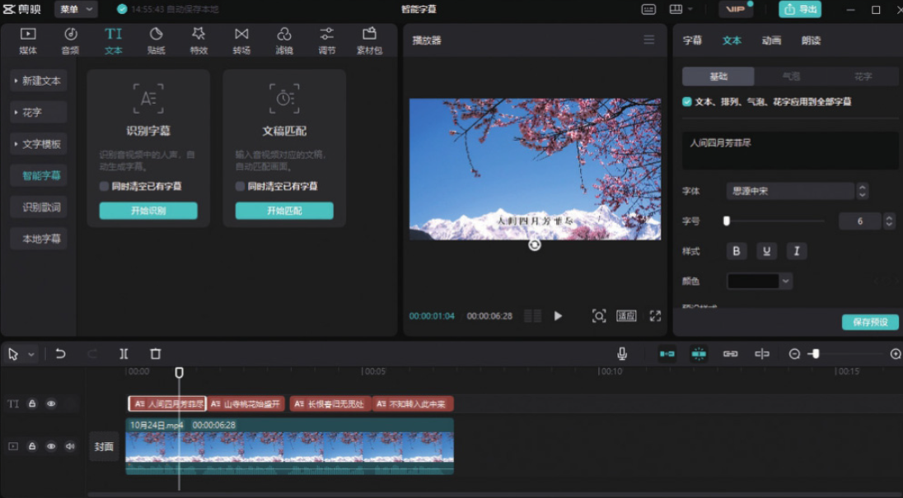

剪映专业版的“智能字幕”功能包含“识别字幕”和“文稿匹配”两个选项，其中“识别字幕”是短视频创作者经常使用的一项功能，特别是在创作口播类视频的时候。

打开剪映专业版软件，在剪辑项目中添加视频素材并将其添加到时间轴中。然后在工具栏中单击“文本”按钮，在文本选项栏中单击“智能字幕”按钮，打开智能字幕选项栏，单击“识别字幕”中的“开始识别”按钮，等待片刻，识别完成后，时间轴中将自动生成文字素材。

选中文字素材，可以在“文本”功能区自由设置文字的字体、颜色、描边、边框、阴影和排列方式等属性，如图 5-58 所示。



```
识别歌词的操作方法与识别字幕的操作方法一致，在剪辑项目中添加一段带有背景音乐的视频素材，然后在文本选项栏中单击“识别歌词”按钮，再单击“开始识别”按钮，等待片刻，识别完成后，时间轴中将自动生成歌词字幕。
```
