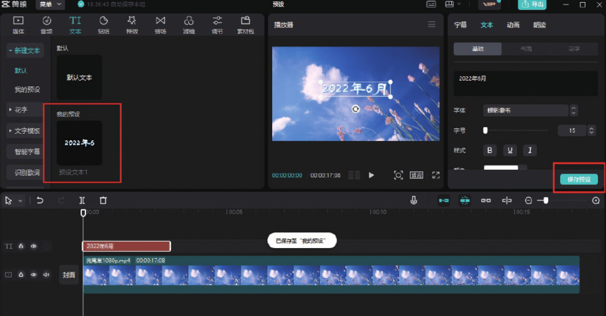
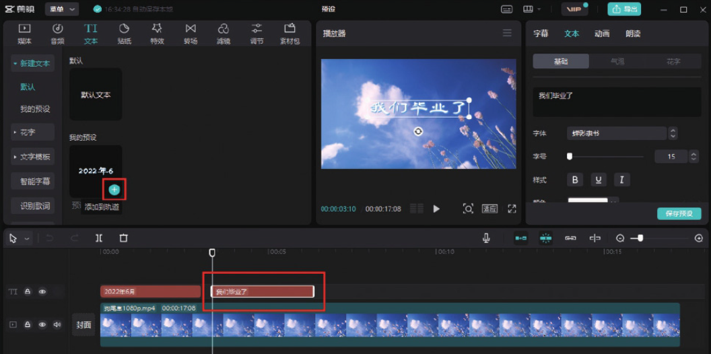

打开剪映专业版软件，在剪辑项目中添加视频素材并将其添加到时间轴中。然后在工具栏中单击“文本”按钮，在“新建文本”选项中单击“默认文本”中的“添加到轨道”按钮，即可在时间轴中添加一个文本轨道。

在“文本”功能区的文本框中输入需要添加的文字内容，并根据实际需要对文字的字体、颜色、描边等属性进行适当的设置，设置完成后单击下方的“保存预设”按钮，将设置好的文本样式保存至“新建文本”选项栏“我的预设”中，如图 5-59 所示。

将时间线移动至需要添加第 2 段文案的位置，在“新建文本”选项中单击“预设文本 1”中的“添加到轨道”按钮，在时间轴中添加一个文本轨道，然后在“文本”功能区的文本框中将文字修改为需要添加的内容，在预览区可以看到刚刚输入的文案与第 1 段文案的字幕样式一模一样，如图 5-60 所示。

