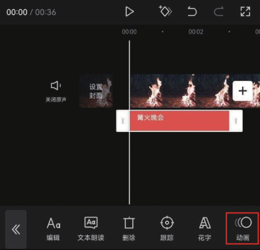
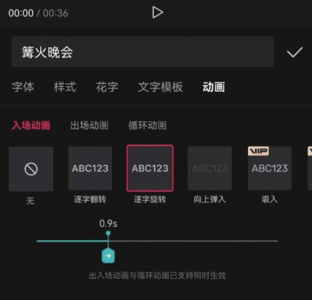
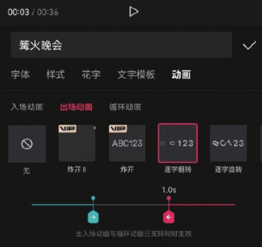
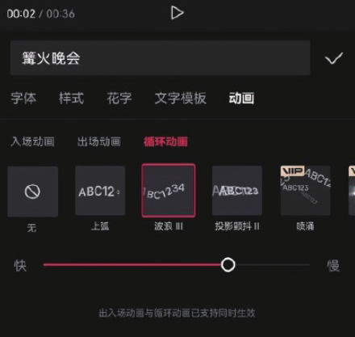

在剪映 App 中打开一个包含文字素材的剪辑草稿，选中一段文本轨道，并在底部工具栏中点击“动画”按钮，如图 5-61 所示。

打开动画选项栏，可以看到有“入场动画”​“出场动画”​“循环动画”3 个选项。入场动画往往和出场动画一同使用，从而让文字的出现和消失更自然。选择一种入场动画效果后，下方会出现一个控制动画时长的滑块，如图 5-62 所示。

选择一种出场动画效果后，会出现一个控制动画时长的红色滑块。调整红色滑块，即可调节出场动画的时长，如图 5-63 所示。

循环动画往往需要文字在画面中长时间停留，且在用户希望其呈现动态效果时才会使用，在设置了循环动画效果后，下方的动画时长滑块将转换为动画速度滑块，用于调节动画效果的速度，如图 5-64 所示。

