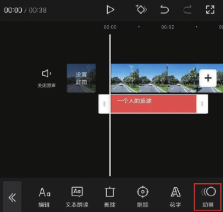
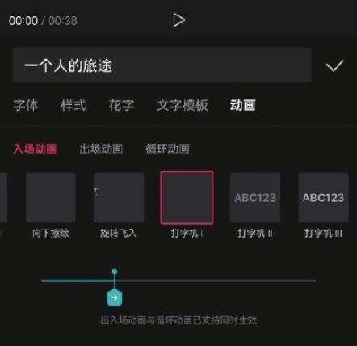
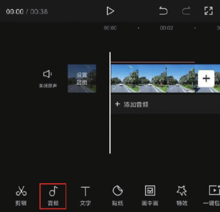
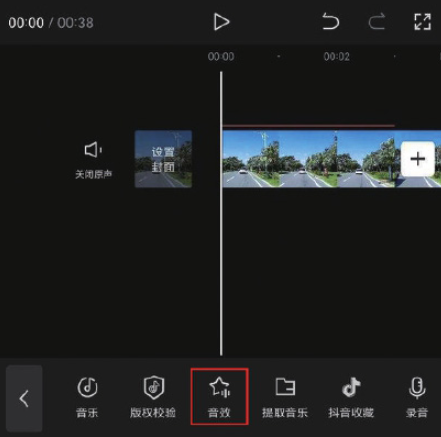
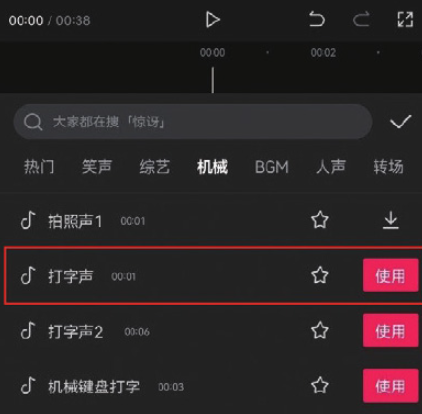
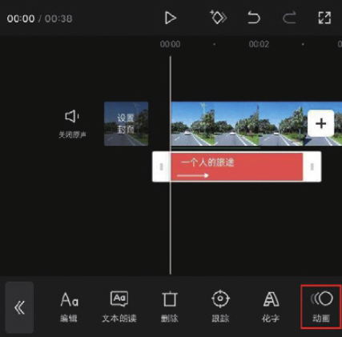
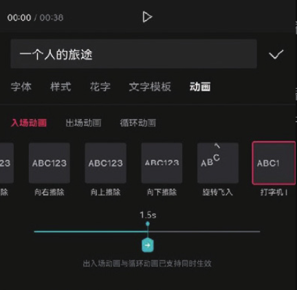

很多视频的标题都是通过打字效果进行展示的，这种效果的制作关键在于文字入场动画与音效的配合。下面将通过制作打字效果来展示如何灵活运用文字。

在剪映 App 中打开一个包含文字素材的剪辑草稿，选中一段文本轨道，并在底部工具栏中点击“动画”按钮，如图 5-65 所示，打开动画选项栏，添加“入场动画”分类下的“打字机 Ⅰ”效果，然后点击按钮保存，如图 5-66 所示。

将时间线定位至视频的起始位置，点击底部工具栏中的“音频”按钮，打开音频选项栏，点击“音效”按钮，如图 5-67 和图 5-68 所示。

打开音效选项栏，选择“机械”分类下的“打字声”音效，点击“使用”按钮，如图 5-69 所示。

想让文字随着打字的音效逐渐出现，就需要调节文字动画的速度。再次选中文本轨道，点击界面底部的“动画”按钮，如图 5-70 所示。

适当增加动画时长，直到最后一个文字出现的时间点与打字的音效结束的时间点基本一致即可。这里，当入场动画时长设置为 1.5s 时，与打字的音效基本匹配，如图 5-71 所示。至此，打字效果制作完成。

