本案例介绍的是古诗词朗诵视频渐显字幕的制作方法，主要使用剪映的“识别字幕”和“动画”功能。下面介绍具体的操作方法。

01 打开剪映 App，在主界面点击“开始创作”按钮，进入素材添加界面，选择一段背景视频素材，点击“添加”按钮，将素材添加至剪辑项目中。

02 进入视频编辑界面后，点击底部工具栏中的“文字”按钮，打开文字选项栏，点击其中的“识别字幕”按钮，如图 5-72 和图 5-73 所示。

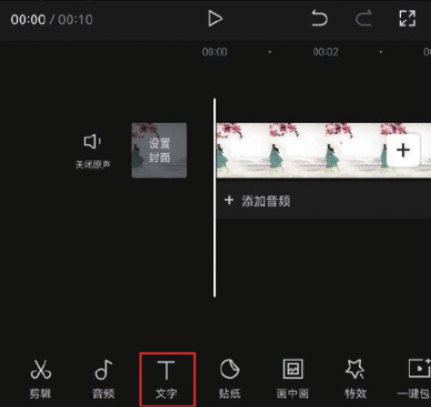
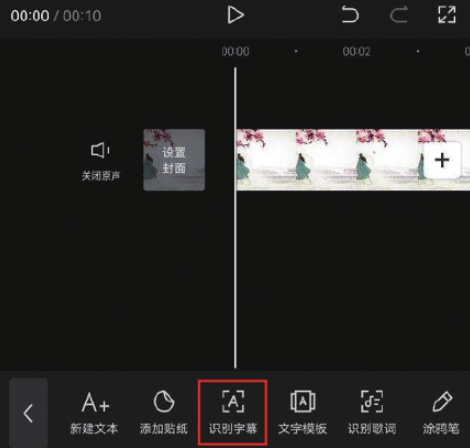

03 在“识别字幕”选项栏中点击“开始匹配”按钮，等待片刻，识别完成后，时间轴中将自动生成歌词字幕，点击底部工具栏中的“编辑”按钮，如图 5-74 和图 5-75 所示。

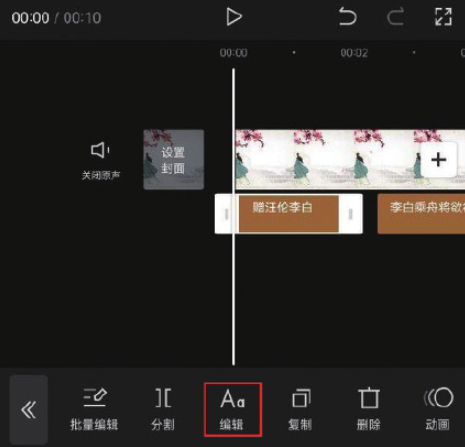

04 打开字体选项栏，选择“刘炳森”字体，如图 5-76 所示。点击切换至样式选项栏，选择“黑底白边”样式，并将“字号”设置为 6，如图 5-77 所示。

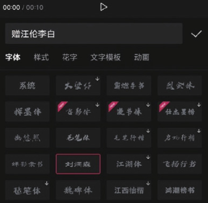
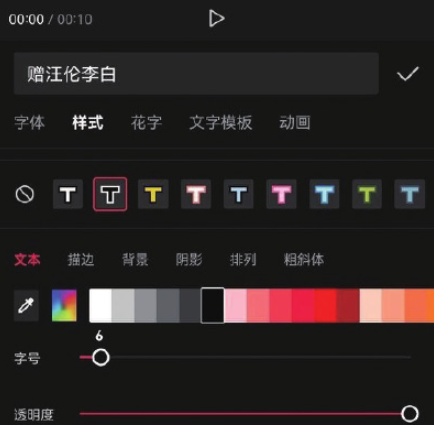

05 在样式选项栏中选择“排列”选项，点击竖排按钮，并将“字间距”调整为 2，如图 5-78 所示；取消选中“应用到所有字幕”选项，点击按钮保存，如图 5-79 所示。

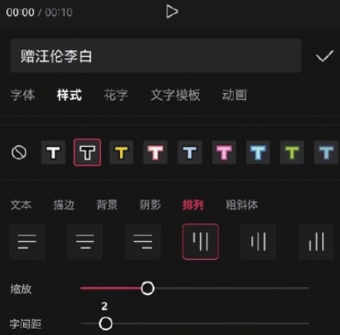
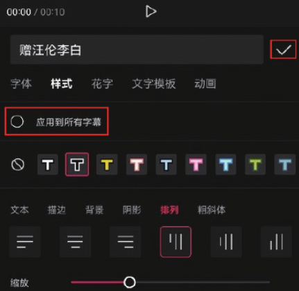

06 在不改变起始时间点的情况下，在时间轴中分别将第 2 段、第 3 段、第 4 段和第 5 段文字素材向下拖动，使它们各自分布在独立的轨道上，如图 5-80 所示。

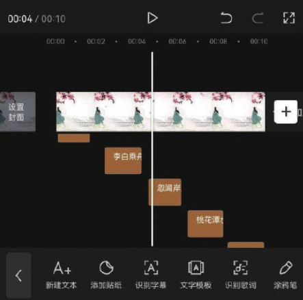

07 完成上述操作后，在时间轴中调整文字素材的持续时长，使它们的尾部和视频素材的尾部对齐，并依次选择第 1 段、第 2 段、第 3 段、第 4 段、第 5 段文字素材，在预览区对文字素材的位置进行调整，如图 5-81 所示。

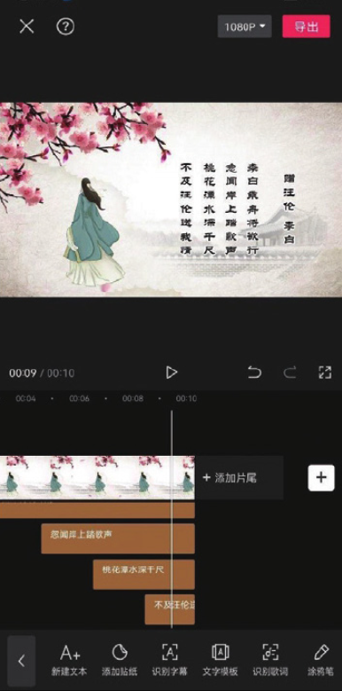

08 在时间轴中选中第 1 段文字素材，点击底部工具栏中的“动画”按钮，如图 5-82 所示，打开动画选项栏，选择“入场动画”中的“向下擦除”效果，并将动画时长设置为 1.5s，点击按钮保存，如图 5-83 所示。

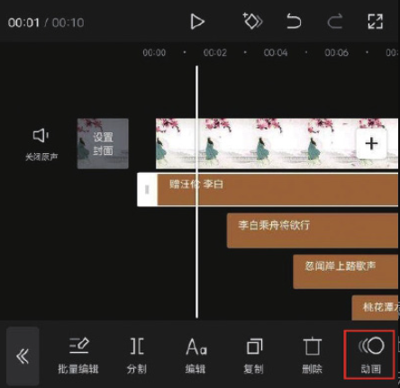
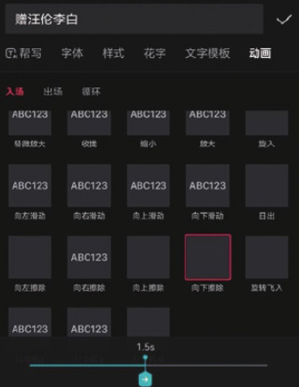

09 参照步骤 08 的操作方法，为余下 4 段文字素材添加“向下擦除”动画效果。点击界面右上角的“导出”按钮，将视频保存至相册，效果如图 5-84 和图 5-85 所示。

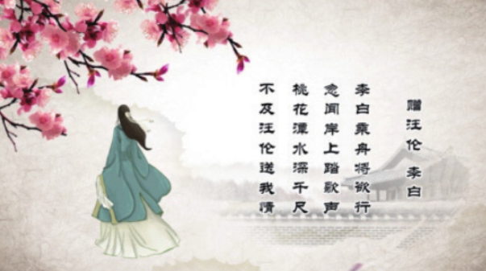
