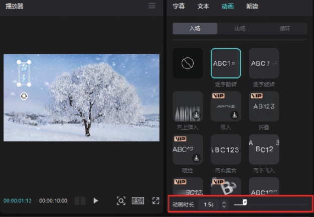
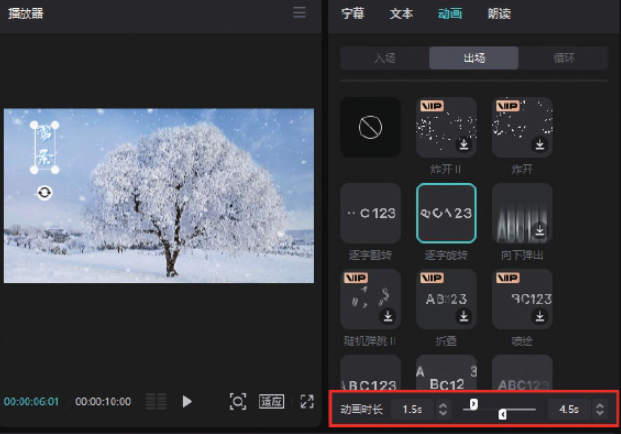
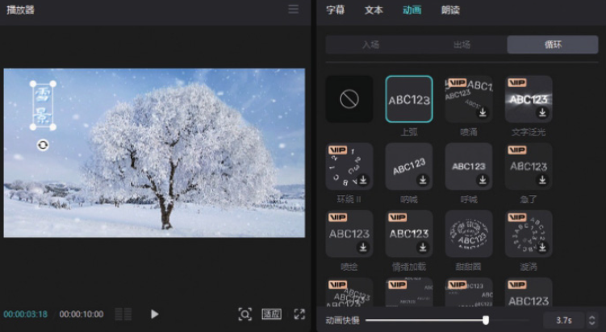

在剪映专业版软件中打开一个包含文字素材的剪辑草稿，在时间轴中选中文字素材，在界面右上角的素材调整区选择“动画”选项，切换至动画选项栏，可以看到里面有“入场”​“出场”​“循环”3 个动画选项。

选择一种入场动画效果后，下方会出现一个控制动画时长的滑块，拖动滑块，即可调节入场动画的时长，如图 5-86 所示。



选择一种出场动画效果后，会出现一个新的控制动画时长的滑块，拖动新滑块，即可调节出场动画的时长，如图 5-87 所示。



为文字素材添加循环动画效果后，下方的“动画时长”滑块将转换为“动画快慢”滑块，用于调节动画效果的速度，如图 5-88 所示。



```
可以为入场动画和出场动画设置动画时长，但无须为循环动画设置动画时长，添加任意一种循环动画效果，该效果就会自动应用到所选的全部片段中。
```
