本案例介绍的是文字消散效果的制作方法，主要使用剪映的“动画”和“滤色”功能。下面介绍具体的操作方法。

01 打开剪映 App，在主界面点击“开始创作”按钮，进入素材添加界面，选择一段背景视频素材，点击“添加”按钮，将素材添加至剪辑项目中。

02 进入视频编辑界面后，点击底部工具栏中的“文字”按钮，打开文字选项栏，点击其中的“新建文本”按钮，如图 5-89 和图 5-90 所示。

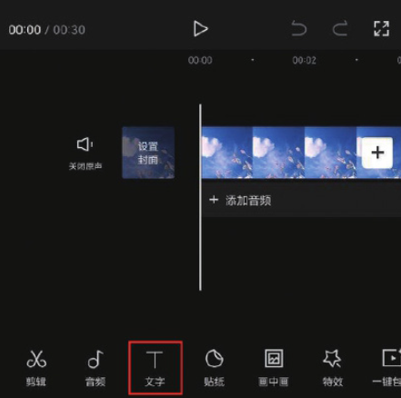
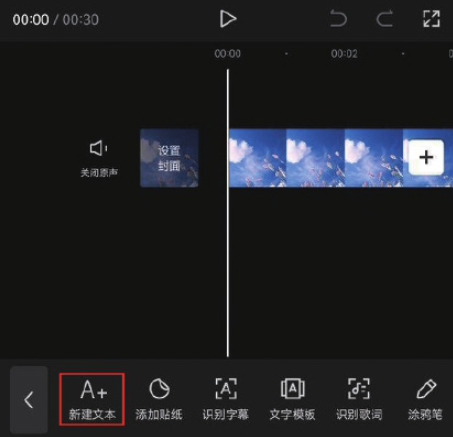

03 在文本框中输入需要添加的文字内容，并在字体选项栏中选择“蝉影隶书”字体，如图 5-91 和图 5-92 所示。

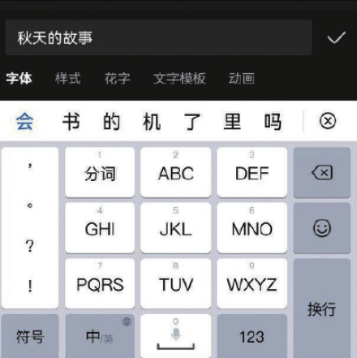
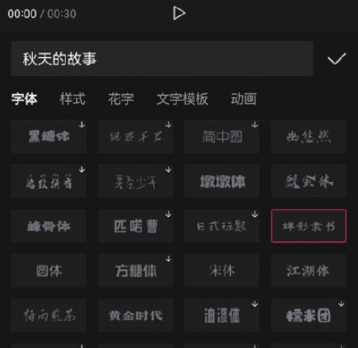

04 点击切换至样式选项栏，选择图 5-93 所示的样式，点击按钮保存。在时间轴中将文字素材的持续时长延长至 4s，点击底部工具栏中的“动画”按钮，如图 5-94 所示。

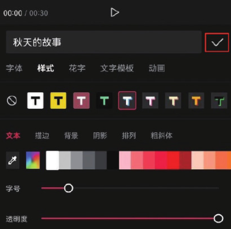
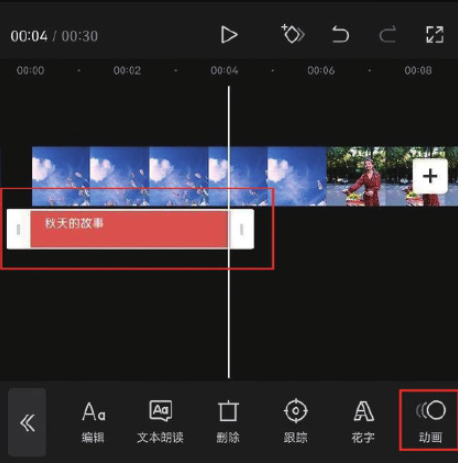

05 在动画选项栏“出场动画”选项中选择“羽化向右擦除”效果，并将动画时长设置为 3.7s，点击确认按钮保存，如图 5-95 所示。

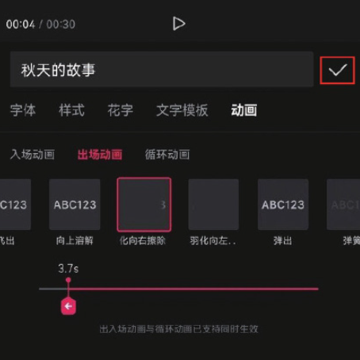

06 将时间线移动至视频的起始位置，点击底部工具栏中的“画中画”按钮，如图 5-96 所示。

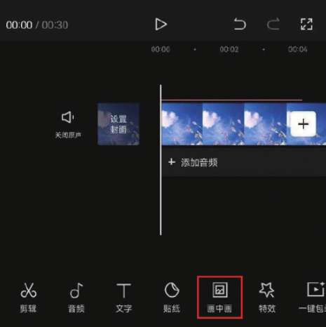

07 点击底部工具栏中的“新增画中画”按钮，如图 5-97 所示，打开手机相册，导入粒子素材，然后点击底部工具栏中的“混合模式”按钮，如图 5-98 所示。

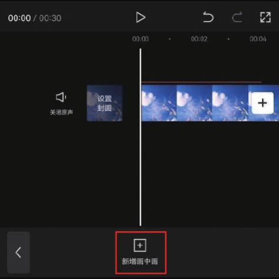
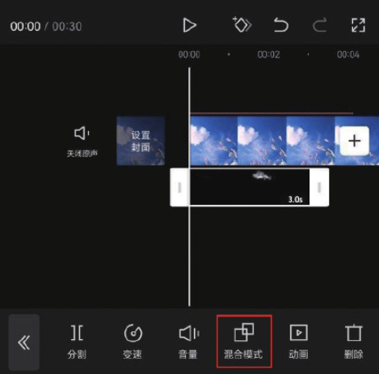

08 在“混合模式”选项栏中选择“滤色”效果，点击按钮保存，如图 5-99 所示。在预览区将粒子素材放大，并将其移动至合适的位置，使其覆盖文字，如图 5-100 所示。

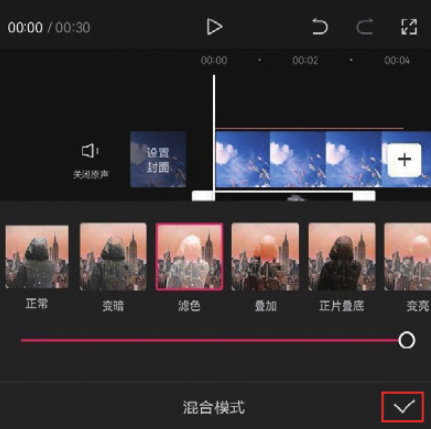
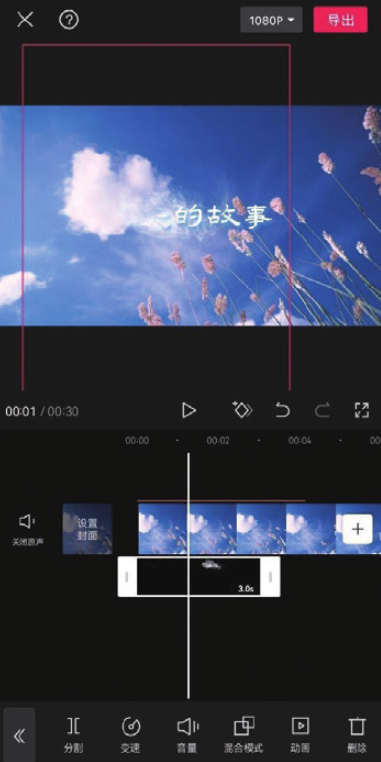

09 点击界面右上角的“导出”按钮，将视频保存至相册，效果如图 5-101 和图 5-102 所示。

