本案例介绍的是电影片尾滚动字幕的制作方法，主要使用剪映的关键帧和“动画”功能。下面介绍具体的操作方法。

01 打开剪映 App，在主界面点击“开始创作”按钮，点击切换至“素材库”选项，选择黑场视频素材，点击“添加”按钮，将素材添加至剪辑项目中。

02 进入视频编辑界面后，点击底部工具栏中的“文字”按钮，打开文字选项栏，点击其中的“新建文本”按钮，如图 5-103 和图 5-104 所示。

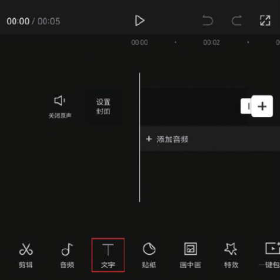
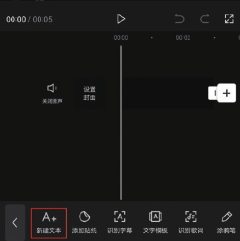

03 在文本框中输入需要添加的文字内容，点击切换至“样式”选项栏，将“字号”设置为 5，如图 5-105 和图 5-106 所示。

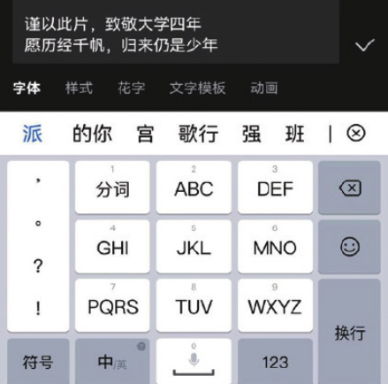
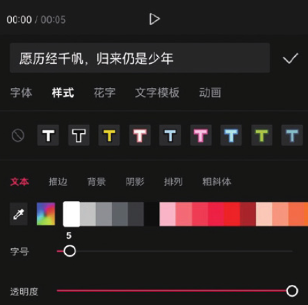

04 选择“排列”选项，将“字间距”设置为 2，将“行间距”设置为 10，并在预览区将文字素材移动至画面的右侧，点击按钮保存，如图 5-107 所示。

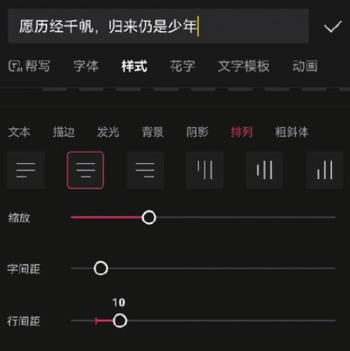

05 在时间轴中将文字素材和黑场素材的时长延长至 38s，如图 5-108 所示。完成上述操作后，点击界面右上角的“导出”按钮，将视频保存至相册。

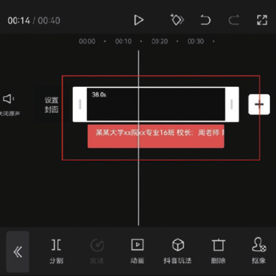

06 打开剪映 App，在主界面点击“开始创作”按钮，进入素材添加界面，选择一段背景视频素材，点击“添加”按钮，将素材添加至剪辑项目中。

07 进入编辑界面后，点击底部工具栏中的“变速”按钮，打开变速选项栏，点击“常规变速”按钮，如图 5-109 和图 5-110 所示。

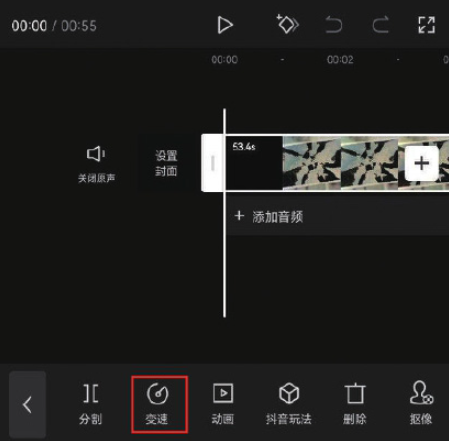
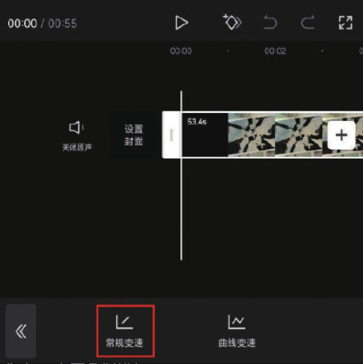

08 在“变速”选项栏中拖动变速滑块，将数值设置为 1.2x，点击按钮保存，如图 5-111 所示。将时间线移动至视频的起始位置，点击界面中的按钮，添加一个关键帧，如图 5-112 所示。

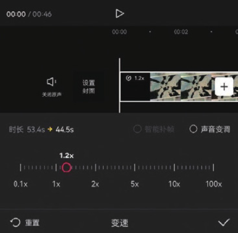
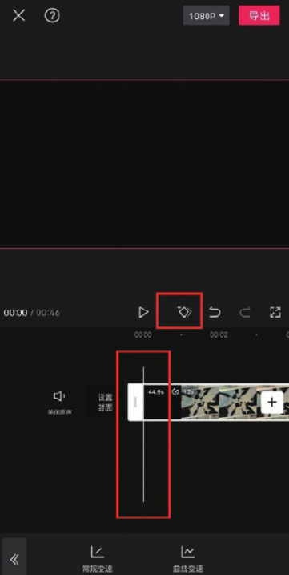

09 将时间线移动至视频的第 4 秒处，在预览区分开双指，将画面放大，此时剪映会自动在时间线所在位置创建一个关键帧，如图 5-113 所示。

10 将时间线移动至视频的第 6 秒处，在预览区将视频素材移动至画面的左侧，剪映会自动在时间线所在的位置创建一个关键帧，如图 5-114 所示。

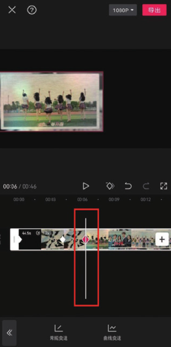

11 在未选中任何素材的状态下，点击底部工具栏中的“画中画”按钮，再点击“新增画中画”按钮，如图 5-115 和图 5-116 所示。

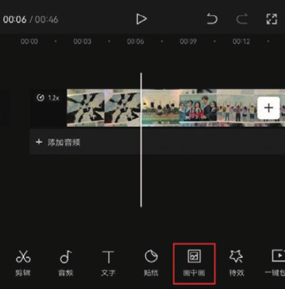
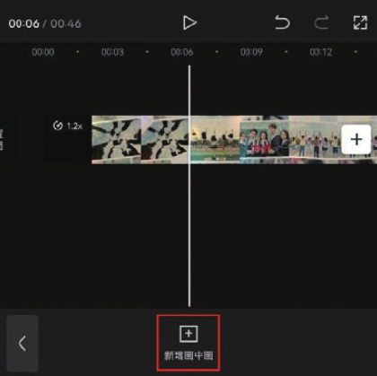

12 打开手机相册，将刚刚导出的文字素材添加至剪辑项目中，点击底部工具栏中的“混合模式”按钮，如图 5-117 所示，打开“混合模式”选项栏，选择“滤色”效果，点击确认按钮保存，如图 5-118 所示。

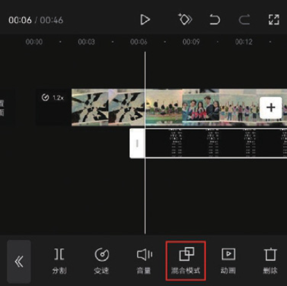
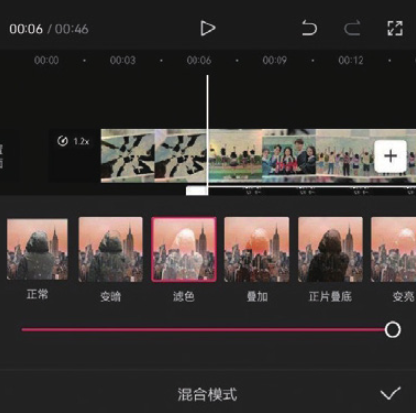

13 将时间线移动至文字素材的起始位置，在预览区将文字素材移动至画面的最下方，点击界面中的按钮，添加一个关键帧，如图 5-119 所示。

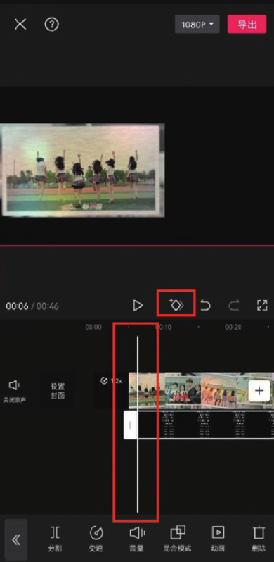

14 将时间线移动至文字素材的尾端，在预览区将文字素材移动至画面的最上方，此时剪映会自动在时间线所在位置创建一个关键帧，如图 5-120 所示。

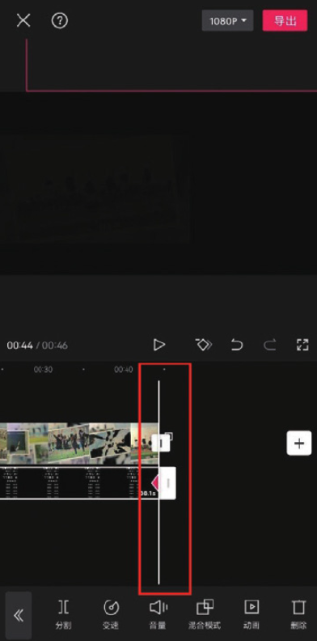

15 为视频添加一首合适的音乐，添加完成后即可点击界面右上角的“导出”按钮，将视频保存至相册，效果如图 5-121 和图 5-122 所示。

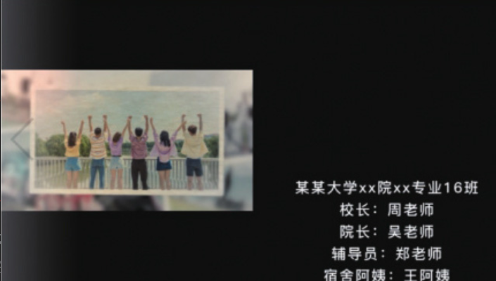
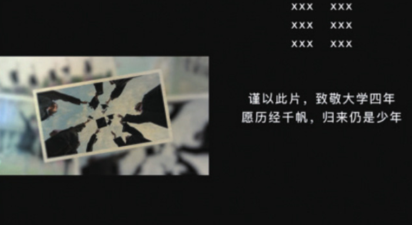
