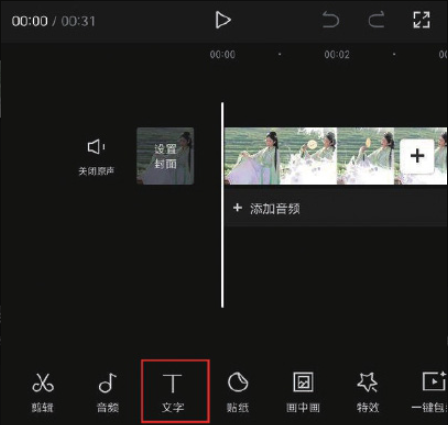
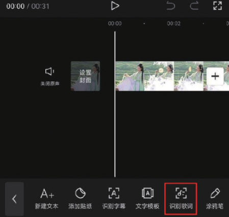
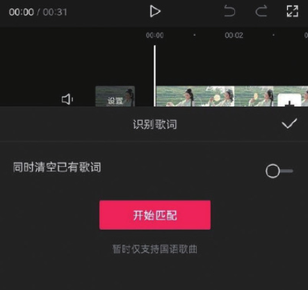
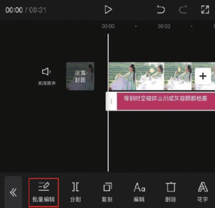
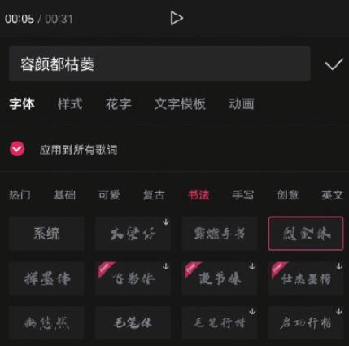
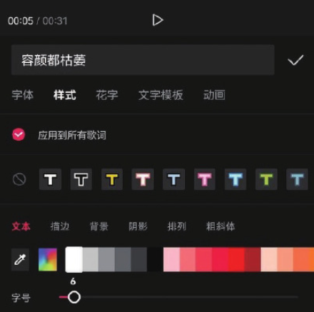
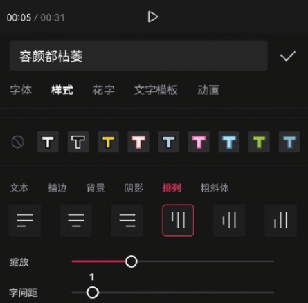
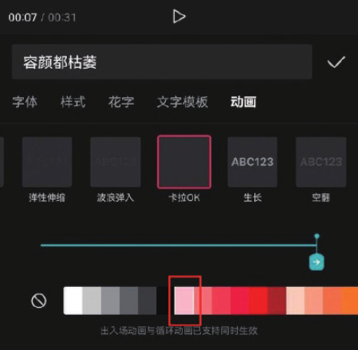

本案例介绍的是卡拉 OK 字幕效果的制作方法，主要使用剪映的“识别歌词”和“动画”功能。下面介绍具体的操作方法。

01 打开剪映 App，在主界面点击“开始创作”按钮，进入素材添加界面，选择一段带有背景音乐的视频素材，点击“添加”按钮，将素材添加至剪辑项目中。

02 进入视频编辑界面后，点击底部工具栏中的“文字”按钮，打开文字选项栏，点击其中的“识别歌词”按钮，如图 5-123 和图 5-124 所示。

03 在“识别歌词”选项栏中点击“开始匹配”按钮，如图 5-125 所示，等待片刻，识别完成后，时间轴中将自动生成歌词字幕，点击底部工具栏中的“批量编辑”按钮，如图 5-126 所示。

04 将文本框中的光标定位至第 1 句歌词中“灰”字的后面，点击键盘中的“换行”按钮，并对歌词进行审校，审校完成后点击“编辑”按钮，如图 5-127 和图 5-128 所示。

05 在字体选项栏中选择“书法”类别中的“烈金体”字体，如图 5-129 所示。点击切换至样式选项栏，将“字号”设置为 6，如图 5-130 所示。

06 选择“排列”选项，将字幕的排列方式设置为竖排，将“字间距”设置为 1，并在预览区将文字素材移动至画面的左侧，设置完成后点击确认按钮保存，如图 5-131 所示。

07 点击切换至动画选项栏，选择“卡拉 OK”效果，将动画时长调整为最大值，并将颜色设置为粉色，设置完成后点击按钮保存，如图 5-132 所示。

08 点击界面右上角的“导出”按钮，将视频保存至相册，效果如图 5-133 所示。

