本案例介绍的是创意倒影字幕效果的制作方法，主要使用剪映的“画中画”​“编辑”​“不透明度”功能。下面介绍具体的操作方法。

01 打开剪映 App，在主界面点击“开始创作”按钮，点击切换至“素材库”选项，选择黑场视频素材，点击“添加”按钮，将素材添加至剪辑项目中。

02 进入视频编辑界面后，点击底部工具栏中的“文字”按钮，打开文字选项栏，点击其中的“新建文本”按钮，如图 5-134 和图 5-135 所示。

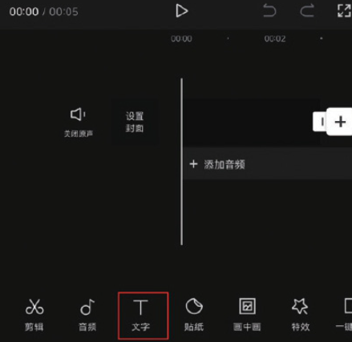
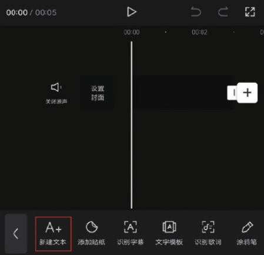

03 在文本框中输入需要添加的文字内容，并在字体选项栏中选择“经典雅黑”字体，如图 5-136 和图 5-137 所示。

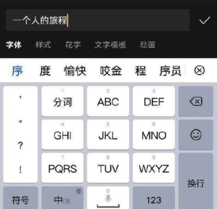
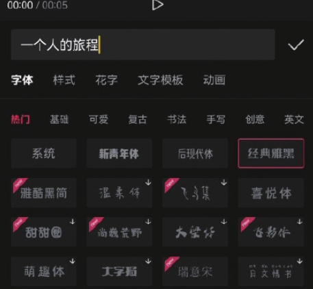

04 点击切换至样式选项栏，选择图 5-138 所示的样式，点击确认按钮保存；在时间轴中将黑场素材和文字素材的时长延长至 6s，并将片尾删除，如图 5-139 所示。点击界面右上角的“导出”按钮，将视频保存至相册。

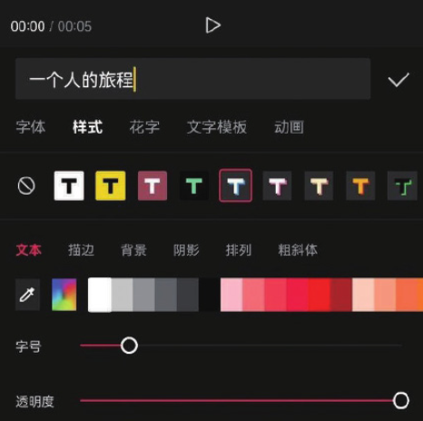
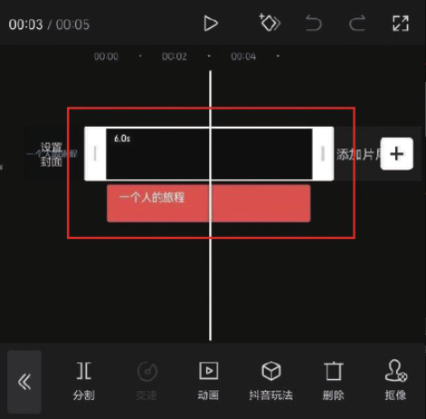

05 打开剪映 App，在主界面点击“开始创作”按钮，进入素材添加界面，选择一段背景视频素材，点击“添加”按钮，将素材添加至剪辑项目中。

06 进入编辑界面后，点击底部工具栏中的“画中画”按钮，再点击“新增画中画”按钮，如图 5-140 和图 5-141 所示。

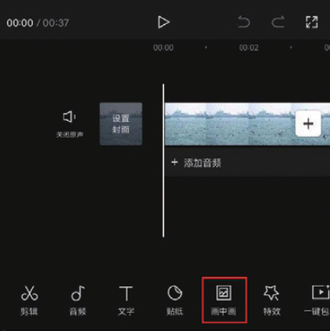
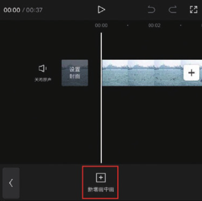

07 打开手机相册，将刚刚导出的文字素材添加至剪辑项目中，点击底部工具栏中的“混合模式”按钮，如图 5-142 所示，打开“混合模式”选项栏，选择“变亮”效果，点击按钮保存，如图 5-143 所示。

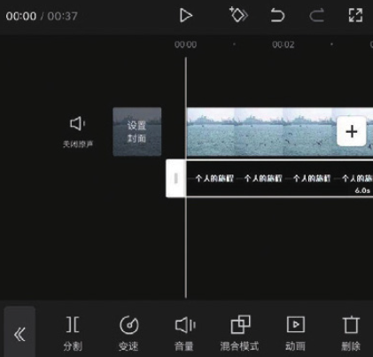
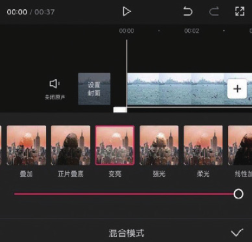

8 在底部工具栏中点击“复制”按钮，如图 5-144 所示，再在时间轴将复制出的素材移动至原素材的下方，点击底部工具栏中的“编辑”按钮，如图 5-145 所示。

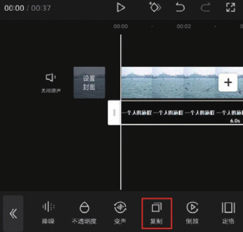
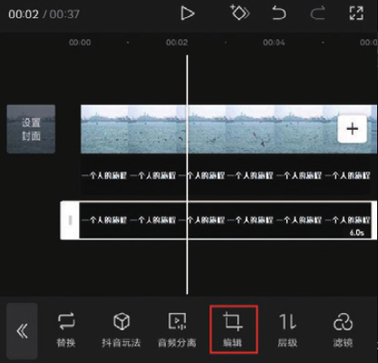

9 在编辑选项栏中点击“镜像”按钮，如图 5-146 所示，再连续点击次“旋转”按钮，并在预览区将复制出的文字素材移动至原素材的下，点击底部工具栏中的返回按钮，如图 5-147 所示。

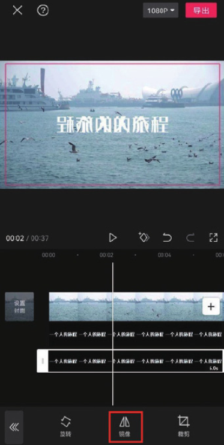
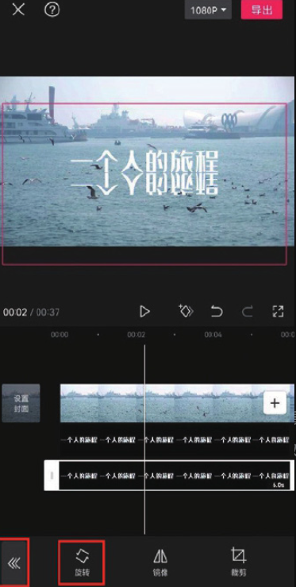

10 点击底部工具栏中的“不透明度”按钮，在“不透明度”选项栏中动滑块，将数值设置为 50，如图 5-148 和图 5-149 所示。

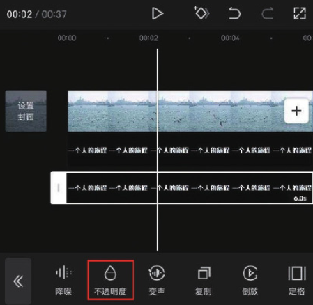
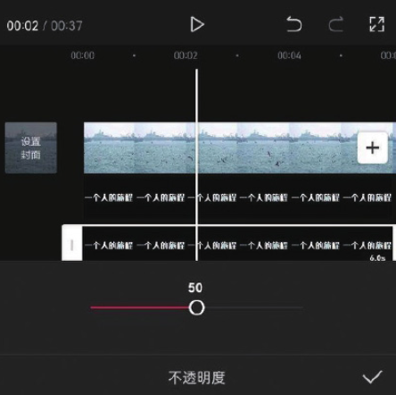

11 点击界面右上角的“导出”按钮，将视频保存至相册，效果如图 5-50 所示。

