本案例介绍的是高级感镂空字幕的制作方法，主要使用剪映的“画中画”和关键帧功能。下面介绍具体的操作方法。

1 打开剪映 App，在主界面点击“开始创作”按钮，点击切换至“素材库”选项，选择黑场视频素材，点击“添加”按钮，将素材添加至剪辑项目中。

2 进入视频编辑界面后，点击底部工具栏中的“文字”按钮，打开文选项栏，点击其中的“新建文本”按钮，如图 5-151 和图 5-152 所。

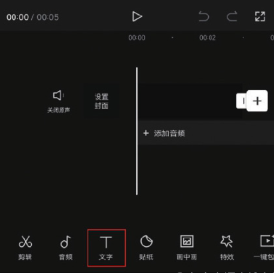
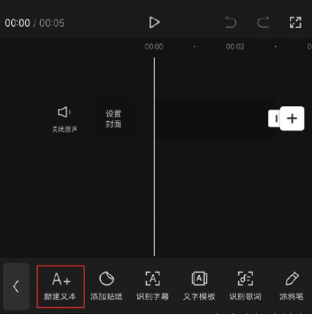

3 在文本框中输入需要添加的文字内容，点击切换至“样式”选项栏，“字号”设置为 39，如图 5-153 和图 5-154 所示。

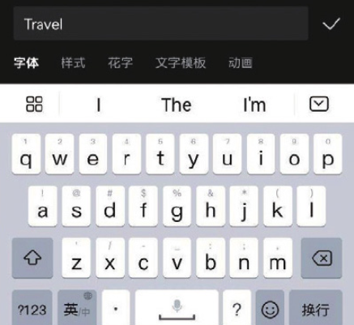
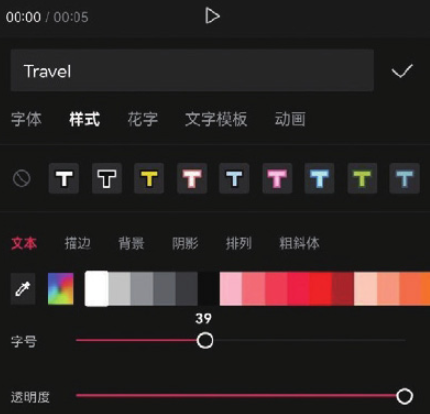

4 在时间轴中将黑场素材和文字素材的时长延长至 4s，将时间线移动至视频的起始位置，点击界面中的关键帧按钮，添加一个关键帧，如图 5-155 示。

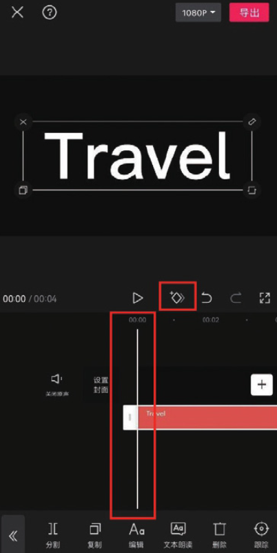

5 将时间线移动至视频的尾端，在预览区分开双指，将画面放大，直至画面被白色覆盖，此时剪映会自动在时间线所在位置创建一个关键帧，如 5-156 所示。操作完成后将视频保存至相册。

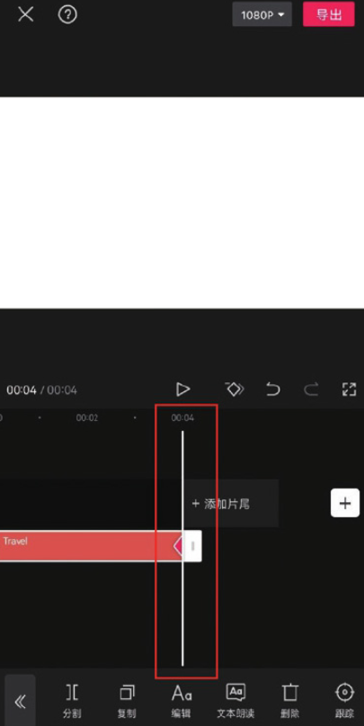

6 打开剪映 App，在主界面点击“开始创作”按钮，进入素材添加界，选择一段背景视频素材，点击“添加”按钮，将素材添加至剪辑项目。

7 在未选中任何素材的状态下，点击底部工具栏中的“画中画”按钮再点击“新增画中画”按钮，如图 5-157 和图 5-158 所示。

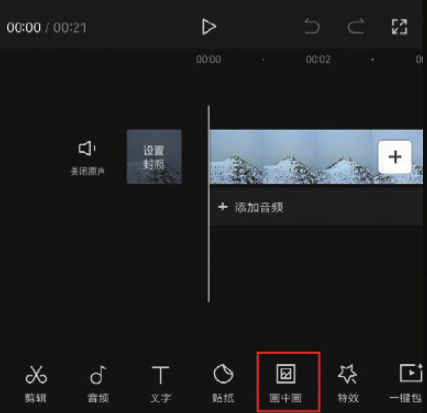
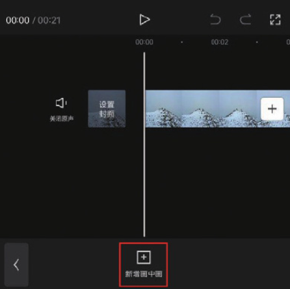

8 打开手机相册，将刚刚导出的文字素材添加至剪辑项目中，点击底部具栏中的“混合模式”按钮，如图 5-159 所示，打开“混合模式”选栏，选择“变暗”效果，点击确认按钮保存，如图 5-160 所示。

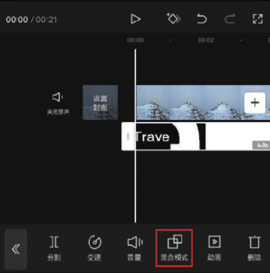
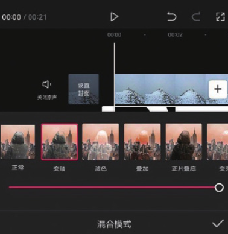

9 将时间线移动至视频的起始位置，在未选中任何素材的状态下，点击部工具栏中的“音频”按钮，打开音频选项栏，点击“音效”按钮，如图 5-161 和图 5-162 所示。

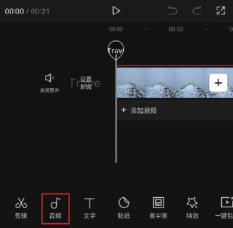
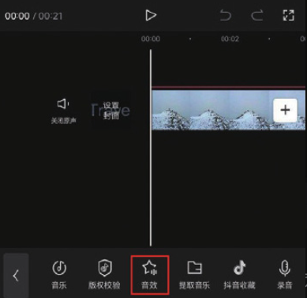

10 打开音效选项栏，在搜索框中输入“穿越音效转场”​，点击键盘中的搜索”按钮，如图 5-163 所示，在搜索出的转场音效中选择图 5-164 所示的音效，点击“使用”按钮。

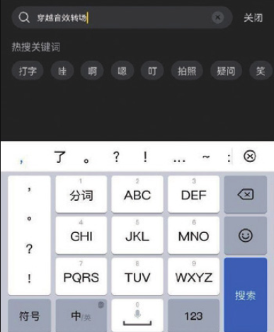
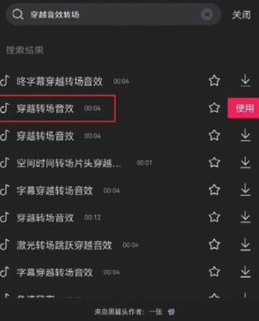

11 点击界面右上角的“导出”按钮，将视频保存至相册，效果如图-165 和图 5-166 所示。

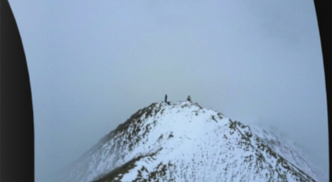
