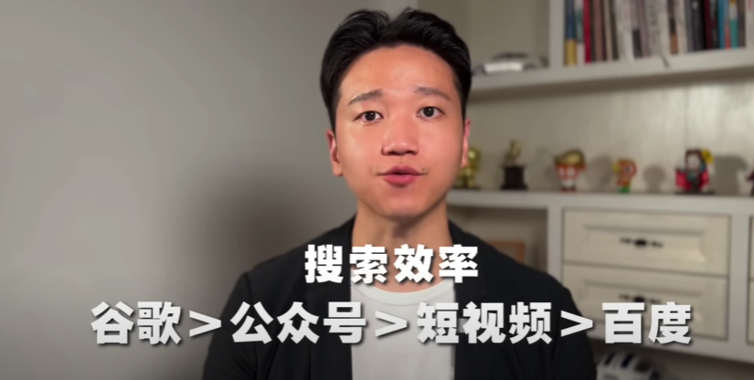
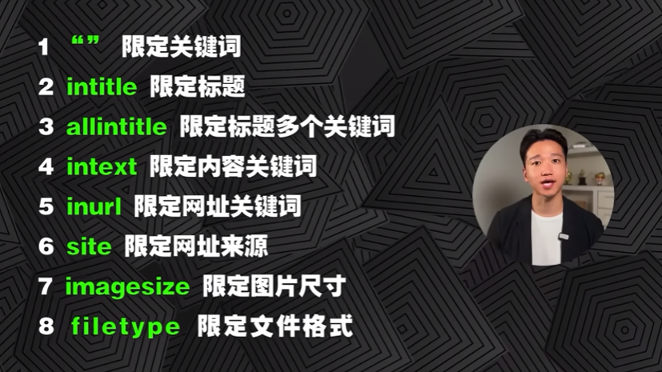
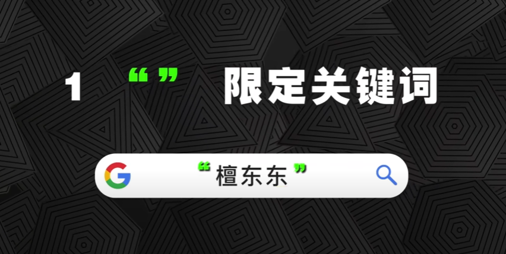

## 前言

搜索技术是普通人变强的唯一外挂，这个视频很长，肯定能帮到你。搜索技术强的人，总是学得比别人快，做得比别人好，一切皆可搜索。你也可以先做些测试，面对以下需求，你首先想到的是去哪里搜索你想要的信息。
1. 比如说你想要查一下 `花溪子眉笔的配方成份` ，去哪里搜？
2. 你想要下载一份 `年终总结的PPT模板` ，去哪里搜？
3. 你想用 `苹果发布会的视频` 进行二创，怎么下载？
4. 你想要搜索并下载一份 `德勤的太空科技的研究报告` ，怎么下载？
5. 你想要研究一下 `日本某款新出的便携式电锯的性能参数` ，去哪里了解？
6. 你想要快速了解 `新加坡和日本这两个国家，他们的这个垃圾分类政策有什么异同` ，去哪里搜？
7. 你想要学习 `管理能力和领导力相关的高质量课程` ，去哪里找？
8. 你想要找一张 `Elon Musk` 的高清照片做封面，去哪里搜？
9. 你想要一段 `西湖的雪景高清视频素材` ，去哪里搜？
10. 你想学一些 `ChatGPT` 的使用教程，去哪里搜？
11. 你已经毕业了，但是你还要搜一篇 `英文文献` ，你去哪里搜？
12. 你想知道 `ChatGPT最新消息` ，应该去哪里看？
13. 你想 `抠出一张照片中的人像` ，但是你又没有学过PS，怎么办？
  
具体答案后面再揭晓，可以肯定的是，百度给不了你想要的答案。就是上面所有的搜索需求，大致可以分为四个大类，这也是我们最常见的搜索了。

1. 一些需求第一类呢是 `信息资讯` ，搜一些新闻、大事件等等。
2. 第二类呢是 `知识技能` ，这个是工作学习必备的。比如说搜一些概念文章教程等等。
3. 第三类呢是 `素材文件` ，视频音频图片，还有些文稿设计文档等等。
4. 第四类呢是 `工具软件` ，各种在线的工具插件，还有一些软件等等都是。
   
那影视剧，娱乐相关的搜索需求呢，我就不单列了，统一放在素材里面。因为这个视频主要讨论的是，工作学习相关的搜索需求，其实等这个视频看完了，不管是电影电视剧这些搜索需求，你都是一样可以搞定的。

事情具体 `去哪里搜` ，先按下拨表。那在此之前，还有个关键的点需要交代清楚，就是你为什么要搜索这些东西，知道 `搜什么` ， `为什么搜` 。才能更好的定位准确， `去哪里搜` ， `怎么搜` ，这个也是我这个视频的核心框架。

`为什么搜` ，就是你搜完之后要干什么？刚好也有这么个事例。

1. 第一类，你是为了知道一些东西，比如说你就想知道中国在亚运会一共取得了多少枚金牌。你就想知道泰勒斯威夫特最先的男朋友是谁这个是 `know something` 。
2. 第二类呢是为了学习一些东西 `learn someting` ，比如说你就想学习视频剪辑教程，你就想学习结构化思维等等。
3. 第三类是为了创作一些东西 `create something` ，比如设计一些海报，创作一条视频，这都属于创作一些东西。
4. 第四类是单纯的为了完成一些特定的任务 `do something` ，比如说你要压缩图片，你要转换格式，你要扣除背景，你要生成二维码，你要翻译等等。这些的需要去完成特定的任务，就是 `do something` 。
   
搜什么和为什么搜之间他不是一一对应的关系。

1. 比如说你为了知道陕西信达罢赛这个事情，你搜了一些相关的信息资讯，关键词 `陕西新的霸赛` ，但是里面提到了两个细节的概念，`nbl` 和 `五罚一掷` 这两个概念。你又不知道什么意思，所以你就要再去搜一些相关的知识点，什么是 `nbl` ？和 `CBA` 是什么区别？有什么联系？`5罚1掷` 又是什么意思？这是你为了了解 `陕西信达罢赛` 这个事件，你需要搜索的内容。有 `信息资讯` ，其实也有 `知识点` 。
2. 同样的道理，你为了 `学习一项技能` ，你可能既要搜索一些 `知识技能` ，你还要搜索一些 `素材文件` ，甚至一些 `工具软件` 。比如说你为了 `学习 chatGPT` 。你要搜一些 `视频教程` ，你可能还要搜一些提效的 `浏览器的插件` 。`学视频剪辑` 也是一样的，你要搜 `教程` ，你要搜 `素材` ，你还搜一些素材的 `下载工具` 。所以为了单纯的 `learn something` 就是 `学习一项技能` 。你可能要搜索很多东西，创作一些东西的时候也是这样。
3. 比如说你要做 `PPT` 。最简单的，你要搜 `知识点` ，你要搜 `图片素材` ，你还要搜一些 `提效的PPT插件` 。
4. 你在做一些其他的设计工作，更是如此。对于完成特点的任务 `do something` ，直接搜索相关的 `工具软件` 就行了。
   
那这个呢就是 `搜什么` 和 `为什么搜` 之间的逻辑关系。知道了 `搜什么` 和 `为什么搜` ，我们才能更加准确的定位 `去哪搜` ， `怎么搜` 。那么接下来我们就重点讲讲 `去哪搜` ？ `怎么搜` ？

## 信息资讯

先说搜索 `信息资讯` 。这个讲究又快又准。举个例子，我们想搜一下 `抖音万粉创作者数量多少` 。微信搜一搜，搜狗搜索，百度，谷歌。我们都来比较的看看。

1. `微信搜一搜` ，主要收的是微信的公众号文章还有视频号的视频。我们输入关键词，点击搜索，根据反馈的结果。这里显示 `截止到2022年6月抖音万粉` 以上的创造者数量达到了 `320万` 。数据来源呢也是 `巨量算数` 发布的 `2022巨量星图达人生态报告` 。这个数据呢还是比较可信的是，比较官方的数据。
2. 再看 `搜狗搜索` 给出的结果，同样的关键词，他并没有给出具体的这个数据是多少，只是说了知识创作者数量突破了50万。其他的这个搜索结果我翻了一下，也没有具体的结果。
3. 我们再看 `百度` ，百度也是一样的，同样的关键词， `抖音万粉创作者数量` 。也没有给出相应的结果，只是给了一个知识创者的数量。跟搜狗搜索一样的。
4. 我们再看 `谷歌` ，同样的关键词 `抖音万分创作者数量` 。他在第一条就直接给出了 `答案` 。 `2022年抖音万分以上创作者数量` 达到了 `320万` 。注意看啊他把这个答案 `32万` 还做了高亮突出显示。这个非常棒，而且也给出了这个具体的数据来源，是 `巨量算数` `2022具量星图达人生态报告` 。这个跟 `微信收一收` 那篇文章里面的数据来源是一样的，还是比较可信的。

所以从这里就可以发现，在搜索国内信息这件事情上，百度居然比不了谷歌，真的不想说什么。

### 搜索效率

从搜索 `信息咨询` 的效率上来说 `谷歌` 大于 `公众号` 大于 `短视频` 大于 `百度`。

`公众号` 大于 `短视频` 是因为很多视频播主，他做内容啊只管博眼球，不管准确度。比如说还是刚刚那个案例，搜索 `抖音万粉创作者数量` 谷歌返回的结果，第二条就是抖音那条视频，我们点开看一下。我们注意看这个视频的标题，它就是 `2023年最新网红统计 你在哪个层级` 。我们点开视频其实看一下这里面它显示的数据，他说 `1万以上的创作者有320万个` ，这个数据明明是 `2022年6月份的` ，他却说是2023年的最新统计。因为短视频创作的门槛非常低，但是里面很多信息的准确度呢也是比较低的。

那为什么 `短视频` 大于 `百度` 。因为最近10年主要的内容生态都沉淀在抖音和腾讯里面，百度百科和百度知道那都是10年之前的事情。

所以大部分情况下呢，我们打开 `微信搜一搜` ，基本上的文章你也可以搜一些视频号的短视频都可以。

`谷歌` 最强，这个是全球公认的，没什么好说的。因为谷歌他会尽可能的 `直接` 给你 `最准确的答案` 。

比如说我们搜索 `杭州亚运会中国获得了多少枚金牌` 。他们直接给你答案 201枚，银牌，铜牌也会给你。他甚至会把其他国家的这个奖牌榜都会直接给你。同样问题，我们切换到百度，他告诉我 `147枚` 。这肯定不对，然后往下翻，其他的链接里面也没有给出准确的案，这个就是百度和谷歌之间的差距。不是一点点。

### 搜索语法

`谷歌` 已经很强了，但是如果你掌握一些基础的搜索语法，你搜索信息资讯会更快更准。

#### 限定关键词

第一个呢，就是 `限定关键词` 。就是在我们的关键词左右两边加上英文的双引号。

- 举个例子，我们要搜索的是 `易阳千喜` ，太阳的阳，喜欢的喜，不是明星的那个易烊千玺。但是反回来结果有 `37,400,0 00` 条。这个呢还主要都是明星的易烊千玺的资料，很少有你想要的 `易阳千喜` 。那这个时候怎么办呢？你不可能从这 `37,400,000` 条里面去慢慢的翻到你想要的结果。这个时候我们可以 `限定关键词` 。直接在 `易阳千喜` 左右两边加上英文的双引号，再回车。就会发现找到了只有 `874` 条结果，而且返回的都是 `易阳千喜` ，太阳的阳，喜欢的喜，这是你想要的结果。这个是限定关键词，能大幅提高你的搜索效率。
- 有些时候你要搜一些报告的数据，也是一样的比如说你要搜 `国际移民按照性别统计` ，你直接输入关键词得到的结果太多了， `234万` 条，你一个个找不知道找到什么时候。但是如果你在关键时左右两边加入限定关键词的这个双引号。你会发现直接给你定位到 `世界移民报告` 里面有一个 `国际移民按性别统计情况` 。你就可以直接定位打开这个报告，然后输入你刚刚这个关键词，就可以直接找到在这篇报告的图4。有一个 `2000年到2020年国际移民按性别统计情况` 。这个就是最快的帮你找到你想要的信息，这个就是 `限定关键词` 的搜索语法，搜索信息效率最快。

#### 限定标题

然后是 `限定标题` 的搜索语法 `intitle` .

- 比如说我们搜索 `iPhone 15摄像头镜灰` 。那会出来很多结果，但是如果我们在前面输入 `intitle:` 我们再回车，就会发现只找到了六条结果。这六条结果里面呢，都有个共同点就是他的标题里面都会出现 `iPhone 15摄像头进灰` 这个关键词。 `iPhone 15摄像头进灰` ，对吧，肯定是有这个关键词的， `iPhone摄像头进灰` ， `摄像头镜灰 iPhone 15` ， `iPhone 15摄像头进灰` 。这个就是限定标题，保证标题里面一定包含你的这个关键词。

##### 语法组合使用

这里提醒一下搜索与法能他是可以 `相互组合的` 。前面我们讲了 `限定关键词` 加上英文的双引号，这里呢是 `intitle` 。

- 那如果说我们在 `intitle` 的后面再加上英文的双引号限定这个关键词，我们看一下结果会怎么样，那这个时候就精准匹配了两条结果， `iPhone 15摄像头进灰` 这就确保了标题里面必定包含你的关键词 `iphone15摄像头进灰` ，而且这几个关键词是限定的，必须完整的一起出现。所以就是 `iPhone 15摄像头进灰` ，然后 `首批iPhone 15摄像头进灰` 。

这个就是 `限定标题` 以及 `限定关键词` 双引号两个 `组合使用` 。

#### 限定多个标题

如果你希望你的标题里面不只出现一个关键词，肯定有两个三个，那这个时候你可以用 `allintitle`
 语法。

 
- `allintitle:李子柒回归` 这是一个关键词，再来一个 `微念` ，中间加个空格。也就说你要求返回的结果标题里面出现两个关键词，一个是 `李子柒回归` ，还有一个是 `微念` 。我们回车看下结果，一共89条，这里面标题都包含了， `李子柒回归` 、 `微念` 。 `李子柒回归` 、 `微念` 。你看所有的标题都会出现你要求的关键词，这个就是 `allintile` 可以限定标题里面包含多个关键词。

- 再比如 `allintitle:吴燕妮 林雨薇 亚运会` ，我们看得到的结果 `亚运会`有了， `林雨薇` 有了， `吴燕妮` 有了。那所有的标题里面都会包含这三个关键词，那也会精准匹配到6条结果。

如果你没有用 `allintitle` 语法，你就会发现返回的结果 `71,900`条。这个就是用搜索语法能够极大的提高你搜寻 `信息资讯` 的这个效率。

#### 限定内容

有了 `intitle` 就会有 `intext`。 就是 `限定文章内容` 里面的关键词。

- 比如说，我们 `intitle:"ELON MUSK"` 然后 `intext:"SpaceX Starship Update"` ，这个搜索语法的意思就是，要求我们搜索结果的标题里面必须包含 `ELON MUSK` 完整出现，然后文章内容里面必须包含 `SpaceX Starship Update` 也是完整出现的。我们返回在结果注意看这里一共得到143条结果，我们最看下面的，这个标题，你看标题里面必定包含 `ELON MUSK` ，然后文章内容必定包含 `SpaceX Starship Update`。 这个就是 `intext` 语法限定你文章内容的语法，也能极大提升你的搜索效率。

##### 搜索个人的一些相关信息

用 `intext` 语法去搜索个人的一些相关信息，效率是非常高的。

我们 `intext:"池晨晨" "浙江大学"`  ，我们看一下会什么结果，这里的一共得到了九条结果。我可以发现这里有一条2013年环境科学硕士研究生复试成绩的名单。这里呢有 `池晨晨` 原来是重庆大学环境工程专业的考研的成绩。在这里后来呢2013年考到了 `浙江大学` 。

再往后看就会发现 `池晨晨` 同学后来去了温州市留学人员服务中心工作。

这里有一个你录取的名单公示。这里公示了 `池晨晨` 她的准考证号，他的招聘岗位以及她的学历，还有他从哪个大学毕业的。这个就是我们前面搜到了这个 `池晨晨` 。

后面还有一些信息的是关于 `池晨晨` 在浙大读研期间，发表过什么论文，以及有哪些专利。这里呢都给你搜出来，我们注意看第二条信息，2018年 `池晨晨` 同学考上了温州市的公务员。

那我们想知道她在温州市发展怎么样，我们可以把 `浙江大学` 这个关键词替换成 `温州市` ，再回车。这样一搜索之后呢，你就可以查到 `池晨晨` 同学在温州市当公务员期间，她的工作表现。那我们往下翻，我们注意看这一条，是关于温州市人社局对一些领导干部的任职通知，这里就有 `池晨晨` 的任职通知。我们可以点开看一下，这个下一片是关于 `池晨晨` 的任职通知，我们点开看一下。这里 `池晨晨` 同学升职了，升任温州市职业介绍服务中心副主任。

如果我们还想看看她在温州市职业介绍服务中心做得怎么样，我们再把关键词 `温州市` 替换成 `温州市职业介绍` 再回车，这里返回的结果就， `池晨晨` 同学在 `温州市职业介绍` 中心，他的主要工作表现，这里有几点啊，一个呢是关于

这里有几点，一个是关于温州零工市场官方平台上线，这里有一些媒体对 `池晨晨` 的采访。然后这一场呢，是关于温州市地方标准家政服务溯源管理规范，这里说到 `池晨晨` 为主要持笔人，也就是说她在温州职业介绍服务中心做副主任期间，主要持笔起草了这一份地方的管理规范，这个也是她的主要政治之一。好，那通过 `intext` 的语法简单搜索之后，我们发现， `池晨晨` 同学为温州的人力资源工作，贡献了自己的力量。这些呢，都是公开的社会信息，不涉及到个人隐私，所以 `intext` 语法用来搜索个人信息资料，还是非常快的。

#### 限定网址

下一个语法是 `inurl` 限定网址关键词。

- 比如说你想搜索， `央视新闻` 对 `李子柒` 的一些报道，你可以输入关键词 `李子柒 inurl:cctv` ，我们再来看一下结果，返回结果当中全部都是 `CCTV` 对 `李子柒` 的采访报导。
- 比如说你看这个，我们搜索 `李子柒` 关键词。然后最看上面这个网址里面必定包含 `CCTV` ，下面都一样，都包含 `CCTV` 。你还可以再加一个关键词 `intex:YouTube` 就是看看央视网对 `李子柒` 油管粉丝的报导。你可以再回车，比如说第一条 `YouTube` 订阅量1410万 `李子柒` 刷新吉尼斯世界纪录，这里的网址都包含 `CCTV` ，然后网页内容里面必定包含 `YouTube` 这个关键词，所有搜索结果都一样。

#### 限定网址来源

其实 `inurl` 这个搜索语法和 `site` 语法很像， `site` 语法呢是限定搜索结果的网站来源，也就是说你这条结果呢，它是明确要求你是从哪个网址出来的。

- 比如说我们搜索 `林雨薇 site:cctv.com` ，这个要求 `site:` 必须跟上完整的域名，不能是仅仅 `cctv` ，也可能是 `xxx.com` 、 `xxx.net` 、 `xxx.cn` 。这个呢必须是完整的域名， `wwww.` 可以不输入然后我们回车看一下，注意看，这里我们得到的结果，全是关于 `cctv.com` 央视网关于 `林雨薇` 的报道，全部都是央视网的结果，这个就是 `site` 语法，它会限定输出结果的网站.

##### 常规网站的域名

这个就要求你必须得知道一些常规网站的域名

- 比如说有个网站是专门发布研究报告的 `199it.com` ，这个时候呢，你可以利用这个语法，比如说你想了解 `母婴` ，那你就输入 `母婴 site:199it.com` ，然后再回车，返回结果全部都是 `199it.com` 这个网站关于 `母婴` 这个主题的研究报告。小红书的，尼尔森的，快手的，这些报告全都在这，你可以去看。这就比你直接百度或者google效果来的快。
- 你想上知乎学习搜索语法，那也可以啊。 `搜索语法 site:zhihu.com` 。返回的结果，全部都是知乎关于 `搜索语法` 的文章，都总结好了放在这。
- 你想了解2024年浙大的保研条件，你直接输入 `2024推荐免试 site:zju.edu.cn` ，那这个是浙大的这个教育网站的域名，你可以直接输入回车，得到的结果，浙江大学关于 `2024` 年接收外校 `推荐免试` 研究生工作安排的通知，这个就是你想要的结果。
- 你想搜索 `pexels.com` 这个网站上关于小猫的一些高清图片，那你可以直接关键词后面加入 `site:pexels.com` ，那这里搜索的结果，注意看，下面全部是来源于 `pexels.com` 这个网站的关于小猫的图片，你随便点击看一下，这个就是关于小猫的高清图片，你可以去下载。如果你把 `pexels` 换成 `pixabay` ，那得到的结果，全部都是 `pixabay` 这个网站关于小猫的高清图片。再把它换成 `gettyimages` 也是一样的，得到的结果全部都是 `gettyimages` 关于小猫的高清图片。

这个就是 `site` 语法，非常精准定位你的搜索结果来自于哪个网站。

#### 限定图片尺寸

说到搜索图片，还有一个厉害的语法，叫做 `imagesize` ，就是限定图片尺寸大小。

- 比如说，我们搜索 `elon musk imagesize:2560x1440` 这个乘号就是 `x` ，大写小写都可以，那么得到的所有图片都是 `2560x1440` ，全部都是关于 `elon musk` 的高清图片。这个尺寸再大一点，也可以，我们换成 `3840x2160` ，你看得到的结果， `3840x2160` ，更大更高清，再大一点 `5760x3840` ，没问题，那这个时候出来的结果全是 `5760x3840` 的图片，非常的高清。所以当你需要高清配图，而且需要限定尺寸的时候，你就用 `imagesize` 这个语法，非常高清。

#### 限定文件格式

当然搜索一些文档的时候，你还可以用 `filetype` 这个语法，就是限定搜索结果的文件格式，可以使图片的格式，也可以是文档的格式。我们用的比较多的就是 `PDF` 文档和 `png` 的图片。

- 比如说你要搜一些研究报告你可以直接 `研究报告 filetype:pdf`。得到的结果，全部都是 `pdf` 文档。
- 比如说我们搜索 `大语言模型 filetype:pdf` ，那返回的结果全是关于 `大语言模型` 的研究报告。比如说第一个上海东方财富证券投资有限公司，关于这个 `大语言模型` 的前世今生和未来，你也可以点开，直接就是 `PDF` 文档。还有下面ai大语言模型的原理、演进及算力测算。ChatGPT浪潮下，看中国 `大语言模型` 产业发展。这些资讯公司和证券公司的一些研究报告是一个非常好的扫盲材料。

当然需要了解某个行业的时候，可以通过这个方法直接搜索相关关键词的研究报告，快速扫盲，非常有学习的价值。以后想了解某行业，就先搜这个行业的研究报告。

- 比如说想了解 `母婴` 行业。你直接输关键字，你就可以得到中国母婴行业的研究报告，直接点进来，这就是 `PDF` 文档。你还可以直接点击右上角的下载按钮，直接下载保存。所以当你想要行业扫盲，或者了解最新的趋势，用 `filetype` 语法最快。
  
`filetype` 语法呢，也可以限定图片的格式。当你想要一个特定格式的图片的时候，你只是输入关键词， 然后回车，通过工具这里类型的筛选，你是无法筛选具体的格式的。但是你在后面加上一个 `filetype:png` 限定 `png` 图片。我们注意看，这个时候筛选栏又多了一个选项 `png` 文件。我们点击下拉菜单，你会发现这里有很多种格式 `jpg` 的， `gif`的 `bmp` 的， `svg` ， `webp` ，还有 `raw` 的文件。这里都有，那这个时候点开，你最看这里全都是 `png` 的透明图片。这个就是 `filetype` 语法，限定文件的格式。

好了以上就是我们一些基础的搜索语法，有

- `""` 限定关键词
- `intitle` 限定标题
- `allintitle` 限定标题多个关键词
- `intext` 限定内容关键词
- `inurl` 限定网址关键词
- `site` 限定网址来源
- `imagesize` 限定图片尺寸
- `filetype` 限定文件格式

掌握这些语法，你搜素信息，就能快人一步。

### 另外直奔信息源头

另外直奔信息源头，能最大程度的保证信息资讯的准确性。

#### [药监局](https://hzpba.nmpa.gov.cn/gccx/)

一开始我们提到的案例当中，去哪里找花西子的配方成本。源头在药监局，国家普通化妆品备案信息，这里有网站，这里可以查询各种化妆品的备案信息。我们去哪看它的成分表呢。直接去的官网，可以找到，这个 `何首乌` ， `首乌眉笔` 。我们往下翻翻，到下面有个包装盒，包装盒上面的有一个，他这里，注意看，这里有一个 `执行标准的编号` ，就是它的 `备案编号` 。 `浙G妆网备字2023012960` ，然后我们把这个 `备案编号` 输入到这个查询网站点，接查询出来了， `花西子螺黛生花眉笔` ，这是它的备案编号，然后这是备案的企业，备案日期2023年6月6号。我们点击查看，这里是生产企业。然后这里是他的成分表，我们注意看，他叫 `首乌眉笔` ，然后这里呢，就是这个眉笔的成分配方表，按到我们国家化妆品法规网的标准的产品配方含量以质量百分比计，全部原料应当按照含量的递减顺序排列。也就是说这个配方表里面所谓的含量是按照递减顺序逐步排列的。我们看最后一个何首乌在那之前是什么呢， `丁羟甲苯` ，这是一个抗氧化剂，按照国家的标准，我查到了丁昌甲苯作为抗氧化剂，一个低毒的，有一定毒性的抗氧化剂，防腐剂，它的添加标准是 `0.15` 。也就是说咱们这个 `花西子何首乌` 的这个眉笔，它的 `何首乌` 含量是肯定低于 `0.15%` 的，因为 `丁羟甲苯` 最高上限只能添加 `0.15%` 的含量，那这个东西它居然叫 `首乌眉笔` ，宣传他的功效。那到底有没效果，我们通过这么一查，我们现在就有数了，下次你再看到一些美妆博主直播带货的时候，吹捧一些产品的功效，你搜一下，你就知道他说的话可不可信。

#### [亚马逊](https://www.amazon.com/) 和 [乐天](https://www.rakuten.co.jp/)

前面还有个案例是，你要研究日本新出了一款 `便携手锯的性能参数` 。那这个去哪找呢，你想象一下，哪里会出现一个产品的详细功能参数的介绍，电商网站的详情页。国内京东，淘宝也是一样的。那我们直接去搜，日本主要用的电商网站是亚马逊和乐天。我们也可以去这两个网站上去找，比如说乐天网上面有关这个电动手锯他的详细参数，具体的性能啊，这里都写得非常清楚，这个呢是了解一个产品性能最快的方法。直接去电商网站他们的详情里面去找，国内京东淘宝天猫也都一样。

#### [Twitter OpenAI](https://twitter.com/OpenAI)

还有，你想知道 `ChatGPT` 最新消息，去哪里看。当然直奔源头的话我们直接去 `x` 关注 `OpenAI` 的官方帐号，然后就可以看到他们最近有哪些大的动作，这里呢就一目了然。

#### [YouTube Tesla](https://www.youtube.com/@tesla)

同样的道理，你也可以去 `YouTube` 关注 `特斯拉` 的官方油管频道，这里的有关它的最新动态。关于 `特斯拉` 机器人， `特斯拉` 汽车等等。这些消息，这里都有。这个是最准的，也是最一手的信息。所以判断信息准确度，要看信息源，要看出出处。是一手源头的信息越准确，可信。张口就来，或说传了18手信息，一般不可信。

综上，选择效率更高的搜素渠道，同时你还掌握了最牛渠道 `谷歌` 的 `基础搜索语法` 。另外，你也知道去 `源头` 搜寻一手信息，这个时候，你获取信息的能力已经大幅提升，远超职场的平均水平。要知道，在智商差不多的情况下， `学习差距 = 信息差 x 时间投入` ，在互联网时代，信息差又完全取决于你的搜索技术的强弱。