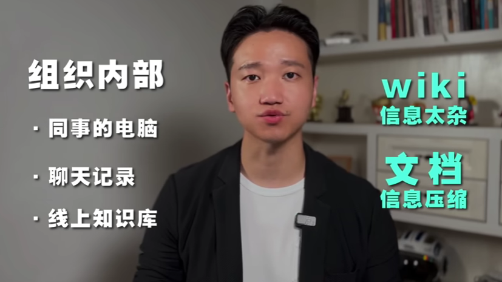
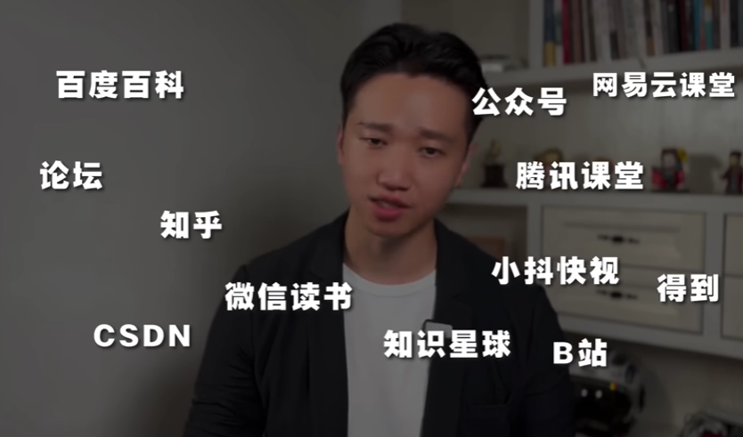

然后我们再说知识技能的搜索，知识技能的搜索，互联网时代只要你想学，获取知识是没有门槛的，都能搜到，那知识一般都储存在哪里呢。

组织内部来说，主要是你们的专业知识，可能储存在同事的电脑里面，有各种项目的全套资料，策划案复盘报告等等等。

也有可能在企微，丁丁，飞书的聊天记录里面。项目群，群文件，群模板等等都是。

还有的就在公司的线上知识库里面，有的是直接用的是企业微信，丁丁，飞书，他们的知识网盘。有的是自己开发的 Wiki系统 ，还有的是使用 第三方知识库平台，都有。但是，知识库有两个极端，一个是 wiki 文本又长又啰嗦，信息太杂了。但是那像 PPT ， PDF 脑图 等等这些文档它太又太简略了，细节信息严重压缩。

那如果是组织外部，储存知识的地方就更多了。各种网页电子书，电子文档，学术论文，笔记软件的App，知识平台的app，还有各种视频网站，还有ai大脑gpt，再有就是真的储存在外面的一些牛人的大脑里面，这些都是组织外部储存知识的地方。

我刚毕业的时候，就特别喜欢抱着电脑去跟领导前辈们一起开会，有的时候纯粹就是为了去蹭会。因为只要在会上，他们说了一些我不知道的名词，或者我不懂的研究案例。我就会立刻搜索，搞懂他，那种成长速度是惊人的。然后呢我就会看群里的一些PPT或者PDF的文件，有不懂的地方，我先通过搜索扫盲，高屏出现了一些知识点，我就会迅速的背下来，然后呢再有不懂的地方，才去请教一些前辈领导，那明眼人一看，我是做过功课的，做着准备再过来去问的，也乐意回答我的问题。那如果说，我傻白的直接去问领导，什么是ptca？这里有多蠢？在互联网上，你可以触达所有的知识载体，这些你都能搜到。

区别就在于，有些知识是免费完全公开的，用谷歌就可以搜到。有些是免费，半公开偏私域的。

- 比如说微信公众号的文章，只有微信和搜一搜能搜到。

还有呢就是一些收费的私域的知识产品。

- 比如说得到App。

### 国内互联网生态去哪里学知识

那国内互联网生态去哪里学知识，太多了，而且很杂，百度百科、论坛、知乎、CSDN、公众号、网易云课堂、腾讯课堂、小抖快视、B站、微信读书、知识星球、得来app。

很多很多，那国外呢，就更多了，谷歌图书、谷歌学术、维基百科、udemy、edx、coursera、wolfram、可汗学院学院、YouTube、duolingo等等。很多很多，但相对来说呢，英语语料的知识质量相对来说会高一点。

国内早几年还，是有很多未爱发电的大神分享了很多专业的有用的知识，但是后来，内容电商和自媒体信息之后，大家都浮躁了。知识零成本的抄袭，还有短视频零碎的交付，导致整个网络上传播的都是同质化的，低质量的，18手的，零碎的知识垃圾。真的已经没救了， `B站` 和 `得到` App算是最后的希望。

15年前，国内互联网的知识主要沉淀在百度知道，百度贴吧，还有一些其他的论坛里面。10年前的，就开始过渡到知乎，微信公，众号里面。五年前，逐步转到音视频的网站，四个短视频，一个中长视频，还有一个音频App。

这里有三个明显的变化。
1. 第一个就是从电脑端转向了移动端，我们搜索知识会更加的快捷方便。
2. 第二个呢就是从文字转向视频，不仅可以交付知识，还能教会些很多操作的技能。以前我们学软件是很麻烦的，很难，要看书，写软件。现在就不需要了，那网上一堆的视频教程。
3. 第三个就是通过音频这种方式去交付知识，也是有一定市场的。这个主要解决的是碎片化学习的场景。

知道了这些趋势，你就不知道了现在国内高质量的知识都在哪里。

但是，如果你把眼光拓展了全世界，不用那么麻烦了。认准 `谷歌` 和 `YouTube` 就够了。 

- `谷歌` 这个全球第一大搜索引擎 `92%` 的市场占有率，绝对统治地位，无人能看懂。
- 第二搜索引擎，不是百度，是 `YouTube` 。而且视频显示的，这里面的中文内容一点都不少，而且质量都很高。 `谷歌` 网页可以一键翻译成中文， `YouTube` 字幕呢也可以自动翻译成任何语言，中文，英文，日语都行。所以你英语不行，没关系，搭配谷歌翻译，全世界的知识库都能为你所用。

那前面说了这么多，知识技能的搜索渠道到底怎么选呢？两个角度。

1. 第一个呢，是看你想要的知识最有可能附着在哪种载体，是在网页上面？还是在 PDF 文档里面?还是说在电子书里面?或者说是在视频教程里面?这个你自己心里有数。比如说你要学教程，那这种肯定是在视频教程里面。
2. 第二个角度呢，就是看你搜索知识技能是为了什么？简单的了解 `know something` ，还是为了系统的学习 `learn something` ，亦或者是为了创作一些内容 `create something` ，这个是有区别的。

### 网页

如果是搜索网页，首当其冲还是 `google` ，最快最强。可以结合前面我们讲的搜索语法 `site` ， `intex` ， `intitle` 等等，就可以快速定位你想的知识。

这一些年，中文的文本类的知识主要沉淀在 `公众号` 和 `知乎` 的文章里面。

那这个时候你可以用搜狗搜索，他是可以直接搜知乎的文章和公众号的文章。

谷歌 `site` 语法可以搜 `知乎` ，但不能搜 `公众号` 的文章。

相对来说，腾讯的内容现在还是比较封闭的，谷歌收不到微信公众号的文章，你只能用 `搜狗` 搜索或者在微信App的 `搜一搜` 里面去搜索。

你说不用百度吗？不用，广告多，内容还差。百度的员工自己都用 `谷歌` ，你说呢。

还有一些专业项，就是社群和聚合的导航网站。这里面的，也沉淀了很多大量的有用的知识经验。

- 比如程序员必逛的 `Github` , `Stack Overflow` , `CSDN` 等等。
- 再有呢，就是像产品经理导航网址，设计师导航网址，新媒体导航网址等等垂类行业的导航网站。

那这些网站怎么找呢，你可以直接谷歌 `xx行业/岗位必逛的网址` 或者 `xx导航网址` ，你就能得到你想要的结果。

总的来说，如果你的知识沉淀再网页中，用 `谷歌` 加 `搜狗` 搜索加 `微信搜一搜` 足够了。

### PDF / 报告 / 论文

然后是 PDF 文档，这也是非常重要的一个知识载体。首当其冲依旧是 `谷歌` 。应用 `filetype` 语法加 `pdf` ，这个方法最快。这个方法可以非常快的搜到很多主流的咨询公司，政权公司，非营利机构，还大厂他们发布的研究报告。

还有一个方法呢是直接去一些垂类的报告的网站，那这个网站怎么找呢？可以用前面我们讲过的这个搜索语法，有一个语法叫 `inurl` ，对吧？我们直接输入 `inurl:baogao` ，我们就能得到报告相关的网站，比如说报告网，报考星球等等。

再进一步有一个很厉害的小工具叫 [SimilarSites](https://www.similarsites.com/)。

你输了一个网址，他可以给你找出很多其他类似的网站，比如前面我们通过 `inurl` 的方法找到了一个发现报告网，然后你把这个网址输入到 `SimilarSites` 里面。就自动给你找到了很多其他同类的网站。比如惠博投研，未来智库，还有行行查，报告厅等等，这些网站都是专门发布研究报告的。

所以结合 `inurl` 加 `SimilarSites`  这两个工具，你可以轻松聚合某个领域的所有头部网站，然后你可以再建个书签文件夹，把这些网站都收集到一块。

如果你要找的知识在 `PDF` 报告里面，就用三个方法 `filetype:pdf` 限定文件格式， `inurl:baogao` 限定报告网址域名， [SimilarSites](https://www.similarsites.com/) 寻找类似网站。

还有一类知识也在 `pdf` 里面，就是学术论文。国内我们就不谈了，如果你想买一份中文论文，你可以直接去淘宝买个帐号，直接去下载就好了。

那如果你要下载的是国际核心期刊的英文论文，还得用 `谷歌学术` 和 `SCI-HUB` 。 `谷歌学术` 做科研的都得用，论文很全，前面学到了 `搜索语法` ，在 `谷歌学术` 里面搜论文，那时候一样也可以用。另外 `谷歌学术` 还可以和 `elon` 的这些论文的编辑软件进行协同，非常好用。 那 `SCI-HUB` 呢，主打就是免费，有将近一亿篇的论文免费下载，每个月中国用户要从这里下载将近五千万篇论文进行研究，缺点是不支持关键词的搜索，像前面讲到的 `搜索语法` 是不能用，他只能搜索论文的完整题目。最近一两年的论文更新的可能不是很及时，如果你想要学习最一手的，最前沿的学术论文， `谷歌学术` 和 `SCI-HUB` 这两个工具，你是必须得用的。

### 电子书

如果你要的知识在电子书上面那你可以去搜电子书。

中文了你就用鸠摩搜书，这里的基本都能找到。社会金庸全集，明朝那些事都有。

英文的话我们就直接谷歌 `best free download sites` ，会出来很多相关的网站，直接进去就行。常见就是 `zlibrary` , `manybooks` , `pdfbooksworld` ，这些网站都可以下载。

还有 `谷歌图书` ，那怎么下载，你自己去研究。另外就是电子书app，国内用户用得最多的就是 `微信读书` 和 `得到App` ，这两个平台的年费呢，加一块一年差不多是400块钱。你读10本书就赚回来了，肯定是划算的。这里多说一点啊，都2023年了，别再说什么自己不习惯读电子书，习惯读纸质书。骗谁呢，这么多年了，你刷了多少公众号的文章，你早就习惯了。

### 视频

然后就是你要搜索的知识技能沉淀在视频这个载体里面，那所有的视频平台都可以。

零岁的呢，你就用短视频平台，比如说怎么样炖个鸡汤？怎么样给猫咪驱虫？这个呢国内的短视频平台都可以。

系统的就用 `B站` , `油管` , `网易云课堂` , `腾讯课堂课` , `可汗学院` , `OpentuCulture` , `Coursera` , `Udacity` , `Edx` 这些视频网站。

如果你记不住没关系直接谷歌 `best online learning websites` ，要多少有多少，免费的，付费的都有。

当然，也很好心人他把各种载体的知识都打包在一块上传到云盘里了。那这个时候呢你就需要 `百度网盘搜索引擎` ，比如 `学搜搜` , `盘搜搜` , `云盘狗` ，这类工具很多。

你直接谷歌一下 `百度网盘搜索引擎` 多的是。

以上就是基于知识在什么载体，对应了哪些搜索渠道。如果你再考虑，你搜索就是技能是为了什么？如果是只是为了 `know something` 简单了解一下，不深究。那就搜网页，搜短视频就够了。如果是为了 `learn something` 系统的学习知识或者 `create something` ，写研究报告啊，写专栏，写书，写论文，写程序，那这个时候，你就要考虑知识的质量，一定要高。你要尽可能的采用源头的，一手知识，像公众号的文章肯定就不如一手的电子书和学术论文。所以你要尽可能的采用高认可度的知识。你学习视频教程，那你就学播方量高的，或者卖得好的视频课程。你对自己所学的知识得有一定的品味，您得知道哪里的知识好，你得挑。否则的话，你学到的知识都是别人咀嚼了N遍之后再喂给你的知识垃圾，这些垃圾，短视频里面最多。除了别人电脑和别人大脑里的知识，其他地方的知识，只要你想，花点时间搜索，付点费用购买，你都是可以拿到的。

我们身边经常会遇到一些伸手党，会说职场新人遇到一定点的问题就张嘴问别人要资料，要答案，要工具。

要知道，在职场没有经过搜索，就直接请教别人是极其不礼貌的，能力马搜到的问题就别问出来被别人当傻子，不懂就问是小孩子，成年人不懂就搜。好了，搜索知识技能就讲到这。