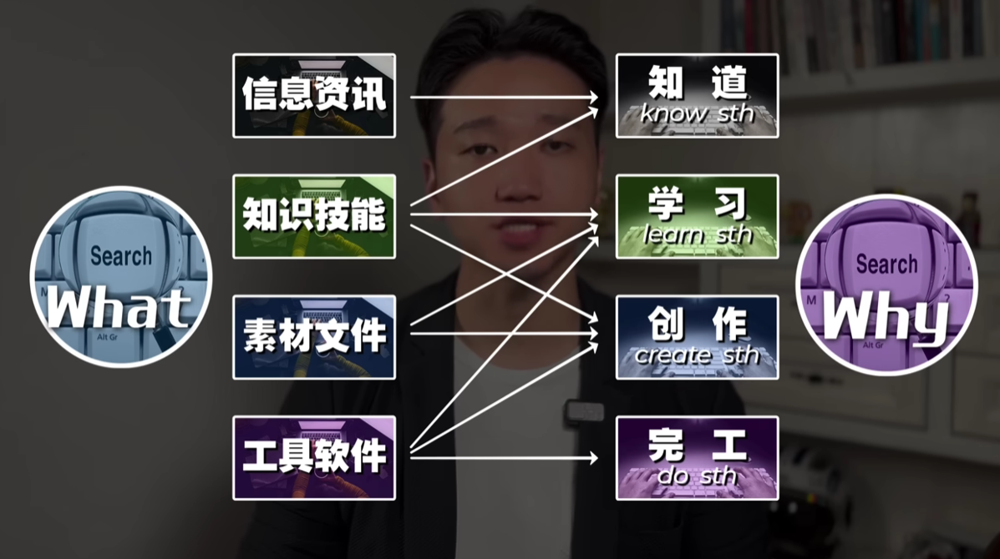

搜索技术是普通人变强的唯一外挂，这个视频很长，肯定能帮到你。搜索技术强的人，总是学得比别人快，做得比别人好，一切皆可搜索。你也可以先做些测试，面对以下需求，你首先想到的是去哪里搜索你想要的信息。

1. 比如说你想要查一下 `花溪子眉笔的配方成份` ，去哪里搜？
2. 你想要下载一份 `年终总结的PPT模板` ，去哪里搜？
3. 你想用 `苹果发布会的视频` 进行二创，怎么下载？
4. 你想要搜索并下载一份 `德勤的太空科技的研究报告` ，怎么下载？
5. 你想要研究一下 `日本某款新出的便携式电锯的性能参数` ，去哪里了解？
6. 你想要快速了解 `新加坡和日本这两个国家，他们的这个垃圾分类政策有什么异同` ，去哪里搜？
7. 你想要学习 `管理能力和领导力相关的高质量课程` ，去哪里找？
8. 你想要找一张 `Elon Musk` 的高清照片做封面，去哪里搜？
9. 你想要一段 `西湖的雪景高清视频素材` ，去哪里搜？
10. 你想学一些 `ChatGPT` 的使用教程，去哪里搜？
11. 你已经毕业了，但是你还要搜一篇 `英文文献` ，你去哪里搜？
12. 你想知道 `ChatGPT最新消息` ，应该去哪里看？
13. 你想 `抠出一张照片中的人像` ，但是你又没有学过 PS，怎么办？

具体答案后面再揭晓，可以肯定的是，百度给不了你想要的答案。就是上面所有的搜索需求，大致可以分为四个大类，这也是我们最常见的搜索了。

1. 一些需求第一类呢是 `信息资讯` ，搜一些新闻、大事件等等。
2. 第二类呢是 `知识技能` ，这个是工作学习必备的。比如说搜一些概念文章教程等等。
3. 第三类呢是 `素材文件` ，视频音频图片，还有些文稿设计文档等等。
4. 第四类呢是 `工具软件` ，各种在线的工具插件，还有一些软件等等都是。

那影视剧，娱乐相关的搜索需求呢，我就不单列了，统一放在素材里面。因为这个视频主要讨论的是，工作学习相关的搜索需求，其实等这个视频看完了，不管是电影电视剧这些搜索需求，你都是一样可以搞定的。

事情具体 `去哪里搜` ，先按下拨表。那在此之前，还有个关键的点需要交代清楚，就是你为什么要搜索这些东西，知道 `搜什么` ， `为什么搜` 。才能更好的定位准确， `去哪里搜` ， `怎么搜` ，这个也是我这个视频的核心框架。

`为什么搜` ，就是你搜完之后要干什么？刚好也有这么个事例。

1. 第一类，你是为了知道一些东西，比如说你就想知道中国在亚运会一共取得了多少枚金牌。你就想知道泰勒斯威夫特最先的男朋友是谁这个是 `know something` 。
2. 第二类呢是为了学习一些东西 `learn someting` ，比如说你就想学习视频剪辑教程，你就想学习结构化思维等等。
3. 第三类是为了创作一些东西 `create something` ，比如设计一些海报，创作一条视频，这都属于创作一些东西。
4. 第四类是单纯的为了完成一些特定的任务 `do something` ，比如说你要压缩图片，你要转换格式，你要扣除背景，你要生成二维码，你要翻译等等。这些的需要去完成特定的任务，就是 `do something` 。

搜什么和为什么搜之间他不是一一对应的关系。

1. 比如说你为了知道陕西信达罢赛这个事情，你搜了一些相关的信息资讯，关键词 `陕西新的霸赛` ，但是里面提到了两个细节的概念，`nbl` 和 `五罚一掷` 这两个概念。你又不知道什么意思，所以你就要再去搜一些相关的知识点，什么是 `nbl` ？和 `CBA` 是什么区别？有什么联系？`5罚1掷` 又是什么意思？这是你为了了解 `陕西信达罢赛` 这个事件，你需要搜索的内容。有 `信息资讯` ，其实也有 `知识点` 。
2. 同样的道理，你为了 `学习一项技能` ，你可能既要搜索一些 `知识技能` ，你还要搜索一些 `素材文件` ，甚至一些 `工具软件` 。比如说你为了 `学习 chatGPT` 。你要搜一些 `视频教程` ，你可能还要搜一些提效的 `浏览器的插件` 。`学视频剪辑` 也是一样的，你要搜 `教程` ，你要搜 `素材` ，你还搜一些素材的 `下载工具` 。所以为了单纯的 `learn something` 就是 `学习一项技能` 。你可能要搜索很多东西，创作一些东西的时候也是这样。
3. 比如说你要做 `PPT` 。最简单的，你要搜 `知识点` ，你要搜 `图片素材` ，你还要搜一些 `提效的PPT插件` 。
4. 你在做一些其他的设计工作，更是如此。对于完成特点的任务 `do something` ，直接搜索相关的 `工具软件` 就行了。

那这个呢就是 `搜什么` 和 `为什么搜` 之间的逻辑关系。知道了 `搜什么` 和 `为什么搜` ，我们才能更加准确的定位 `去哪搜` ， `怎么搜` 。那么接下来我们就重点讲讲 `去哪搜` ？ `怎么搜` ？
