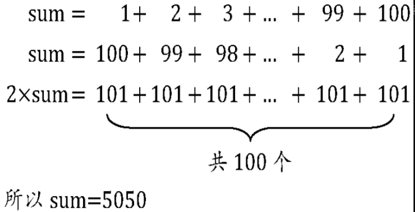

大家都已经学过一门计算机语言，不管学的是哪一种，学得好不好，好歹是可以写点小程序了。现在我要求你写一个求1+2+3+……+100结果的程序，你应该怎么写呢？

大多数人会马上写出下面的C语言代码（或者其他语言的代码）：

```python
    int i, sum = 0, n = 100;
    for（i = 1; i < = n; i++）
    {
        sum = sum + i;
    }
    printf（" %d ", sum）;
```

这是最简单的计算机程序之一，它就是一种算法，我不去解释这代码的含义了。问题在于，你的第一直觉是这样写的，但这样是不是真的很好？是不是最高效？

此时，我不得不把伟大数学家高斯的童年故事拿来说一遍，也许你们都早已经听过，但不妨再感受一下，天才当年是如何展现天分和才华的。

据说18世纪生于德国小村庄的高斯，上小学的一天，课堂很乱，就像我们现在下面那些窃窃私语或者拿着手机不停摆弄的同学一样，老师非常生气，后果自然也很严重。于是老师在放学时，就要求每个学生都计算1+2+…+100的结果，谁先算出来谁先回家。

天才当然不会被这样的问题难倒，高斯很快就得出了答案，是5050。老师非常惊讶，因为他自己想必也是通过1+2=3，3+3=6，6+4=10，……，4950+100=5050这样算出来的，也算了很久很久。说不定为了怕错，还算了两三遍。可眼前这个少年，为何可以这么快地得出结果？

高斯解释道：



用程序来实现如下：

```python
    int i, sum = 0,n = 100;
    sum = （1 + n） * n / 2;
    printf（"%d", sum）;
```

神童就是神童，他用的方法相当于另一种求等差数列的算法，不仅仅可以用于1加到100，就是加到一千、一万、一亿（需要更改整型变量类型为长整型，否则会溢出），也就是瞬间之事。但如果用刚才的程序，显然计算机要循环一千、一万、一亿次的加法运算。人脑比电脑算得快，似乎成为了现实。

