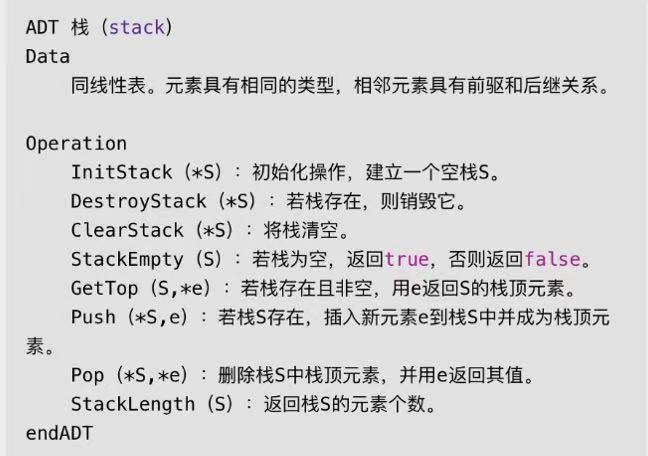

## 栈

栈是限定仅在表尾进行插入和删除的线性表。栈又称为后进先出的线性表，简称 `LIFO` 结构。



### 栈的进栈出栈变化形式

栈对线性表的插入和删除的位置进行了限制，并没有对元素进出时间进行限制，也就是说，在不是所有元素都进栈的情况下，事先进去的元素也可以出栈，只要保证是栈顶元素出栈就可以。

### 顺序栈

栈的顺序存储其实也就是线性表顺序存储的简化，我们简称为顺序栈。

线性表是用数组来实现的，对于栈这种只能一头插入删除的线性表来说，用数组下标0的一端作为栈底比较好。

### 两栈共享空间

栈的顺序存储只准栈顶进出元素，不存在线性表插入和删除时需要移动元素的问题。

栈的顺序存储必须事先确定数组存储空间大小，否则需要编程手段来扩展数组的容量，非常麻烦。

对于两个相同类型的栈，可以最大限度地利用其事先开辟的存储空间进行操作。

## 链栈

链栈是栈的链式存储结构，简称链栈。

链栈的栈顶指针和单链表的头指针合二为一，不需要头节点。

### 链栈和顺序栈的比较

链栈和顺序栈在时间复杂度上是一样的，均是 O(1) 。

顺序栈需要事先确定一个固定长度，可能会存在内存空间浪费的问题，但它的优势是存取时定位方便。

链栈则要求每个元素都有指针域，这同时也增加了一些内存开销，但对于栈的长度无限制。

### 斐波那契数列

迭代实现斐波那契数列。

```javascript
function fbi(number) {
  const a = [0, 1];
  for (let i = 2; i <= number; i++) {
    a[i] = a[i - 1] + a[i - 2];
  }

  return a[number];
}
```

递归实现斐波那契数列。

```javascript
function fbi(number) {
  if (number < 2) {
    return number === 0 ? 0 : 1;
  }

  return fbi(i - 1) + fbi(i - 2);
}
```

递归过程退回的顺序是它前行顺序的逆序。在退回过程中，可能要执行某些动作，包括恢复在前行过程中存储起来的某些数据。

这种存储某些数据，并在后面又以存储的逆序恢复这些数据，以提供之后使用的需求，显然很符合栈这样的数据结构。

在前行阶段，对于每一层递归，函数的局部变量、参数值以及返回地址都被压入栈中。

在退回阶段，位于栈顶的局部变量、参数值以及返回地址被弹出，用于返回调用层次中执行代码的其余部分，也就是恢复调用的状态。

### 四则运算


后缀表达式，也称为逆波兰表达式（Reverse Polish Notation，简称 RPN），是一种数学表达式的表示方法，其中操作符位于操作数之后。

传统的计算器无法处理带有大中小括号的四则运算，引入了四则运算表达式的概念，可以输入括号。逆波兰表示法解决了程序实现四则运算的难题。


**后缀表达式计算结果**

初始化一个空栈，对要运算的数字进出使用。

从左到右遍历表达式的每个数字和符号，遇到是数字就进栈，遇到是符号，就将处于栈顶两个数字出栈，进行运算，运算结果进栈，一直到最终获得结果。

**中缀表达式转后缀表达式**

我们把平时所用的标准四则运算表达式，即 9 + (3 - 1) * 3 + 10 / 2 叫做中缀表达式。

规则：
1. 从左到右遍历中缀表达式的每个数字和符号，若是数字就输出，即成为后缀表达式的一部分；
2. 若是符号，则判断其与栈顶符号的优先级，是右括号或优先级低于栈顶符号（乘除优先加减）则栈顶元素依次出栈并输出，并将当前符号进栈，一直到最终输出后缀表达式为止。

### 常见场景

- 弹夹式手枪的子弹。
- 浏览器的 `后退` 键，World、Photoshop等文档或图像编辑软件中的 `撤销` 操作。
- 递归。
- 四则运算表达式求值。
