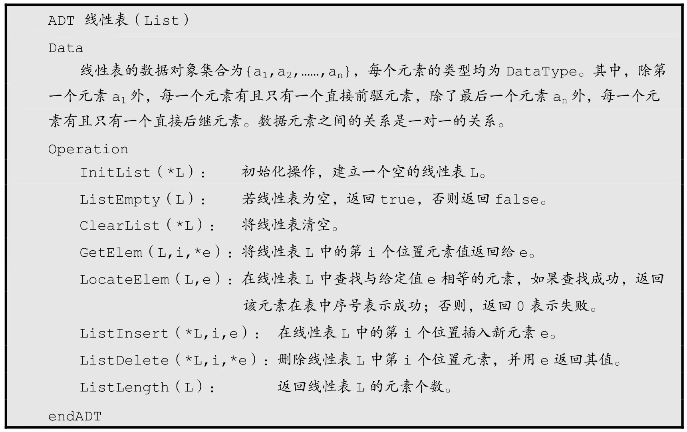
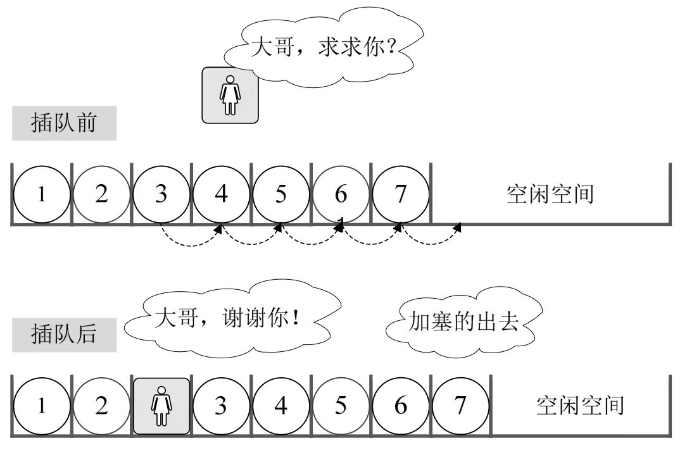
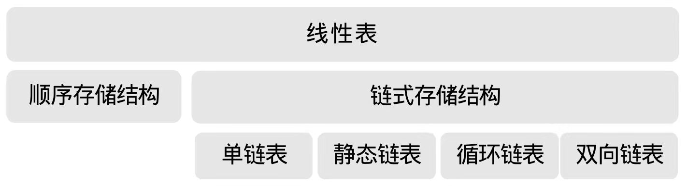

`线性表` 是一种 `基本的数据结构` ，它是由n个具有 `相同数据类型的元素` a₁, a₂, ..., aₙ 组成的 `有限序列` 。在线性表中，元素之间存在 `一对一` 的关系，每个元素都有其 `前驱` 和 `后继` ，除了 `第一个元素没有前驱` 和 `最后一个元素没有后继` 外。线性表中元素的个数称为线性表的 `长度` ，当长度为零时，线性表为 `空表` 。



线性表的两种常见表示方式为顺序表和链表。我们先来了解一下 `顺序表` 。

## 顺序表

`顺序表` 指的是用一段地址连续的存储单元依次存储线性表的数据元素。

### 顺序表的数据元素

我们先来了解两个概念：

1. 线性表中的每个元素的类型相同，所以可以用一维数组实现顺序表的存储结构。
2. 线性表的长度是线性表中数据元素的个数，随线性表插入和删除操作的进行，这个量是变化的。

然后，看一下 `顺序表` 初始化过程：

```javascript
class SeqList {
  constructor(maxSize) {
    this.maxSize = maxSize; // 最大容量
    this.length = 0; // 当前长度
    this.data = new Array(maxSize); // 用数组来存储元素
  }
}
```

下面我们将从 `时间复杂度` 的维度进行了解 `顺序表` 。

### 地址计算方法（元素存取）

值得注意的是线性表的第 `i` 个元素是要存储在数组下标为 `i - 1` 的位置上，即 `数据元素的序号` 和 `存放它的数组下标` 之间存在对应关系。用数组存储顺序表意味着要分配固定长度的数组空间，假设占用 `c` 个存储单元，那么线性表中的第 `i + 1` 个元素的存储位置满足下列关系（ `LOC` 表示获得存储位置的函数）

```
Loc(aᵢ₊₁) = LOC(aᵢ) + c
```

所以对于第 `i` 个数据元素 `aᵢ` 的存储位置可以由 `a₁` 推算得出：

```
Loc(aᵢ) = LOC(a₁) + (i -1) * c
```

通过这个公式，你可以随时算出线性表中任意位置的地址，不管它是第一个还是最后一个，都是相同的时间，其时间复杂度为 `O(1)` 。

由此可知，顺序表的数据元素的存取时间复杂度为 `O(1)` 。接着，我们看一下顺序表的插入的时间复杂度是多少。

### 顺序表的插入



如上图所示，从最后一个元素开始向前遍历到第 `i` 个位置，分别将他们都向后移动一个位置，表长加 `1` 。

算法实现代码如下：

```javascript
{
  // 在指定位置插入元素
  insert(index, element) {
    if (index < 0 || index > this.length || this.length >= this.maxSize) {
      console.error("插入位置不合法或线性表已满");
      return false;
    }

    for (let i = this.length - 1; i >= index; i--) {
      this.data[i + 1] = this.data[i]; // 元素后移
    }
    this.data[index] = element;
    this.length++;
    return true;
  }
}
```

由上述代码可得，此时间复杂度为 `O(n)` 。

可以发现 `顺序表` 在 `插入` 时需要移动大量的元素，耗费时间， `删除` 也是相同的原理。另外，还需要面临预留内存空间的问题，当我们学习 `链式存储结构` 后，这两个问题就可以进行解决的。

### 顺序表的优缺点

**优点**

1. 无须表示表中元素之间的逻辑关系而增加额外的存储空间
2. 可以快速地存储表中任意位置的元素

**缺点**

1. 插入和删除操作需要移动大量元素
2. 当线性表长度变化较大时，难以确定存储空间的容量
3. 造成存储空间的 `碎片`

## 单链表（链式存储结构

用一组任意的存储单元存储线性表的数据元素，这组存储单元可以是连续的，也可以是不连续的。

### 线性表链式存储结构的组成

数据元素 `aᵢ` 的存储映像由 `数据域` 和 `指针域` 组成， `数据域` 存储数据元素信息， `指针域` 存储直接后继的信息。

线性表链式存储结构通过每个结点的指针域将线性表的数据元素按其逻辑次序链接在一起，形成单链表。

然后，看一下 `单链表` 初始化过程：

```javascript
class Node {
  constructor(data) {
    this.data = data;
    this.next = null;
  }

  free() {
    this.data = null;
    this.next = null;
  }
}

class LinkedList {
  constructor() {
    this.head = null; // 头结点
    this.length = 0; // 链表长度
  }
}
```

同样的，我们将从 `时间复杂度` 的维度进行了解 `单链表` 。

### 单链表的读取

在单链表中，第 `i` 个元素的存储位置无法一开始就确定，需要从头开始查找。

算法思路包括：

1. 声明一个结点 `current` 指向链表第一个结点，初始化 `count` 从 `1` 开始；
2. 当 `count < i` 时，遍历链表，让 `current` 的指针后移动，不断指向下一结点， `current` 累加 `1` ；
3. 若到链尾 `current` 为空，则说明第 `i` 个元素不存在；否则查找成功，返回结点 `p` 的数据。

实现代码算法如下：

```javascript
{
  // 获取指定位置的元素
  get(index) {
    if (index < 0 || index >= this.length) {
      console.error("获取位置不合法");
      return null;
    }

    let current = this.head;
    let count = 0;
    while (count < index) {
      current = current.next;
      count++;
    }
    return current.data;
  }
}
```

可以发现该算法的时间复杂度是 `O(n)` ，在数据元素 `读取` 和 `存入` 的性能不如顺序存储结构。

哈，世间万物总是有两面的，有好自然有不足，有差自然有优势。下面我们来看一下在单链表中如何实现 `插入` 和 `删除` 

### 单链表的插入

先来看一下单链表的插入。单链表第 `i` 个数据插入结点的算法思路：

1. 声明一结点 `current` 指向第一个结点，初始化 `count` 从 `1` 开始；
2. 当 `count < i` 时，就遍历链表，让 `current` 的指针后移动，不断向下一结点， `count` 累加 `1` ；
3. 单链表的插入标准语句 `newNode.next = current.next; current.next = newNode;`

实现代码算法如下：

```javascript
// 在指定位置插入元素
  insert(index, data) {
    if (index < 0 || index > this.length) {
      console.error("插入位置不合法");
      return false;
    }

    const newNode = new Node(data);
    if (index === 0) {
      newNode.next = this.head;
      this.head = newNode;
    } else {
      let current = this.head;
      let prev = null;
      let count = 0;
      while (count < index) {
        prev = current;
        current = current.next;
        count++;
      }
      newNode.next = current;
      prev.next = newNode;
    }
    this.length++;
    return true;
  }
```

可以发现该算法的时间复杂度是 `O(n)` ，单链表数据结构在插入和删除操作上，与顺序表是没有太大优势的。但如果，我们希望在第 `i` 个位置，插入 `10` 个元素，对于顺序存储意味着，每一次插入都需要移动 `n - 1` 个元素，每次都是 `O(n)` 。而单链表，我们只需要在第一次时，找到第 `i` 个位置的指针，此时为 `O(n)` , 接下来只是简单地通过赋值移动指针而已，时间复杂度都是 `O(1)` 。

显然，对于 `插入` 或 `删除` 数据越频繁的操作，单链表的效率优势就越是明显。


### 单链表整表的删除

单链表整表删除的目的是为了释放内存空间，单链表的整表删除的思路如下：

1. 声明一结点 p 和 q。
2. 将第一个结点赋值给p。
3. 循环：将下一结点赋值给 q，释放 p ，将 q 赋值给 p

实现代码算法如下：

```javascript
{
  // 删除整个链表
  deleteList() {
    let p,q;
    p = this.head;
    while (p) {
      q = p.next;
      free(p);
      p = q;
    }
    this.head = null;
    return true;
  }
}
```

### 拓展

**头插法实现：**

```javascript
{
  // 在链表头部插入元素
  insertAtHead(data) {
    const newNode = new Node(data);
    newNode.next = this.head;
    this.head = newNode;
    this.length++;
  }
}
```

**尾插法实现：**

```javascript
{
  // 在链表尾部插入元素
  append(data) {
    const newNode = new Node(data);
    if (!this.head) {
      this.head = newNode;
      this.tail = newNode;
    } else {
      this.tail.next = newNode;
      this.tail = newNode;
    }
    this.length++;
  }
}
```

## 静态链表

**定义：** 

静态链表是一种通过数组来描述单链表的实现方式。

**特点：** 

静态链表的 `空闲链表管理` 和 `结点申请` 、 `结点插入`等结点操作需要自己实现。 

## 循环链表

**定义：** 

循环链表是一种单链表，其终端结点的指针端由空指针改为指向头结点，形成一个环。循环链表的简称是单循环链表。

**特点：** 

循环链表解决了一个很麻烦的问题，即如何从当中一个结点出发，访问到链表的全部结点。

循环链表和单链表的主要差异就在于循环的判断条件上，原来是判断 `current.next` 是否为空，现在则是 `p.next !== this.head`  则循环未结束。 

### 循环链表的查找

在单链表中，我们可以用 `O(1)` 的时间访问第一个结点，但对于要访问到最后一个结点，却需要 `O(n)` 时间，因为我们需要将单链表全部扫描一遍。

循环链表中，我们可以用 `O(1)` 的时间由链表指针访问到最后一个结点，因为只需要改造一下这个循环链表，不用头指针，而是用指向终端结点的尾指针来表示循环链表

### 循环链表的合并

将两个循环链表合并成一个表时，有了尾指针就非常简单了。

只需要将原 `A` 表的头结点赋值给 `rearB.next` , 然后释放 `p` 即可。

## 双向链表

双向链表是在单链表的每个结点中，在设置一个指向其前驱结点的指针域。

### 双向链表的插入

插入操作并不复杂，不过顺序很重要，千万不能写反了。

插入操作需要先搞定 s 的前驱和后继，再搞定后结点的前驱，最后解决前结点的后继。 

### 双向链表的删除

删除操作只需要两步骤，把 p.next 赋值给 p.prior 的后继，再把 p.prior 赋值给 p.next 的前驱。

## 单链表结构和顺序存储结构的优缺点

### 单链表和顺序表的对比

如果 `线性表` 需要频繁 `查找` ，很少进行 `插入` 和 `删除` 时，宜采用 `顺序表` 。

如果需要频繁 `插入` 和 `删除` 时，宜采用 `单链表` 。

### 单链表和顺序表的使用场景

对于用户注册的个人信息，除了注册时插入数据外，绝大多数情况都是 `读取` ，所以应该考虑用顺序存储结构。

游戏中的玩家的武器或者装备列表，随着玩家的游戏过程中，可能会随时 `增加` 或者 `删除` ，此时再用顺序存储就不太合适了，单链表结构就可以大展拳脚。

### 顺序表和单链表的优缺点

顺序表和单链表各有其优缺点，不能简单的说哪个好，哪个不好，需要根据实际情况，来综合平衡采用哪种数据结构更能满足和达到需求和性能。

### 单链表和顺序表的使用场景

当线性表中的元素个数变化大或者根本不知道有多大时，最好采用单链表，这样可以不需要考虑存储空间的大小问题。

如果事先知道线性表的大致长度，比如一年12个月，这种用顺序存储结构效率会高很多。


## 应用案例

1. 幼儿园小朋友的排队次序。
2. 星座列表。
3. 班级同学的点名册。
4. 排队买演唱会门票的人群。
   
错误理解
1. 公司组织架构

## 总结回顾

这一章，我们主要讲的是线性表。

先谈了它的定义，线性表是零个或多个具有相同数据元素的有限序列。然后谈了线性表的抽象数据类型，如它的一些基本操作。

之后我们就线性表的两大结构做了讲述，先讲的是比较容易的顺序存储结构，指的是用一段地址连续的存储单元依次存储线性表的数据元素。通常我们都是用数组来实现这一结构。

后来是我们的重点，由顺序存储结构的插入和删除操作不方便，引出了链式存储结构。它具有不受固定的存储空间的限制，可以比较快捷的插入和删除的特点。然后我们分别就链式存储结构的不同形式，如单链表、循环链表和双向链表做了讲解，另外我们还讲了若不使用指针如何处理链表结构的静态链表方法。

总的来说，线性表的这两种结构其实是后面其他数据结构的基础，把它们学明白了，对后面的学习有着至关重要的作用。

