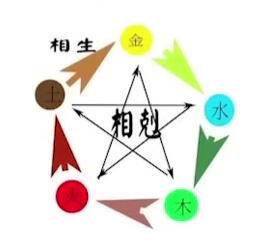

道教认为，我命有我不由天， 通过研究生命的规律可以去趋吉避凶，好事发生的时候那就把它加强一下，然后好事更好，但是坏事要发生了，那么怎么办呢~我们去规避一下，大事给化解掉，大事化小，小事化了。

---

## 五行

有个东西大家是没有办法省略的，就是**五行**，这个五行是道家文化所独有的一个传统文化，道教他认为**天地万物都分阴阳和五行**，那么通过这个学习**五行相生相克**，这是所有周易学派的一个基础，不管你以后学八字奇门遁甲，大六任，小六任，梅花艺术，紫微斗数，黄极其势等等，周易分很多门派很多学科但是他的核心就是**五行**。

五行相生
- 水: 地球出现的第一个元素
- 水生木: 植物需要水来灌溉
- 木生火: 钻木取火
- 火生土: 火燃烧后变成灰, 灰就是土
- 土生金: 沙里淘金
- 金生水: 用金属工具挖井

五行向克
- 金克木: 用金属制作的斧头可以砍树
- 木克土: 植物吸收了土里的营养
- 土克水: 水来土掩
- 水克火: 水能灭火
- 火克金: 火能把金属融化

## 四季土

1-12月分别用地支表示: 寅卯**辰** / 巳午**未** / 申酉**戌** / 亥子**丑**
- 其中每个季度的最后一个月份都是属土, 分别是 **辰 / 未 / 戌 / 丑**
- 寅月和卯月属木, 巳月和午月属火, 申月和酉月属金, 亥月和子月属水

## 天干

| 天干 | 方向 | 阴阳 | 颜色 | 身体部位 | 意向 |
| --- | --- | --- | --- | --- | --- |
| 甲 | 东方 | 阳木 | 绿色 | 肝 | 大树 |
| 已 | 东方 | 阴木 | 绿色 | 胆 | 花草 |
| 丙 | 南方 | 阳火 | 红色 | 小肠 | 太阳, 圆形物品 |
| 丁 | 南方 | 阴火 | 红色 | 心脏, 血液 | 蜡烛, 电灯泡, 烟头 |
| 戊 | 中央 | 阳土 | 黄色 | 胃 | 城墙土 |
| 己 | 中央 | 阴土 | 黄色 | 脾 | 田地 |
| 庚 | 西方 | 阳金 | 白色, 金色 | 大肠 | 宝剑, 大刀, 汽车 |
| 辛 | 西方 | 阴金 | 白色, 金色 | 肺 | 首饰, 小型金属物品 |
| 壬 | 北方 | 阳水 | 黑色, 蓝色 | 膀胱 | 大江, 大河, 大湖, 大海 |
| 癸 | 北方 | 阴水 | 黑色, 蓝色 | 肾 | 小溪, 水井, 小河, 露水, 下水道 |

## 地支

| 地支 | 方向 | 颜色 | 阴阳 | 月份 | 时间 | 藏天干 | 动物代表 |
| --- | --- | --- | --- | --- | --- | --- | --- |
| 子 | 正北方 | 黑色, 蓝色 |  阳水 | 阴历11月 | 23点到凌晨1点 | 本气癸 | 鼠 |
| 丑 | 东北方 | 黄色 |  阴土 | 阴历12月 | 凌晨1点到3点 | 本气己, 中气辛, 余气庚 | 牛 |
| 寅 | 东北方 | 绿色 |  阳木 | 阴历一月 | 凌晨3点到5点 | 本气甲, 中气丙, 余气戊 | 老虎 |
| 卯 | 正东方 | 绿色 |  阴木 | 阴历二月 | 凌晨5点到7点 | 本气乙 | 兔子 |
| 辰 | 东南方 | 黄色 |  阳土 | 阴历3月 | 上午7点到9点 | 本气戊, 中气已, 余气庚 | 龙 |
| 巳 | 东南方 | 红色 |  阴火 | 阴历4月 | 上午9点到11点 | 本气丙, 中气戊, 余气庚 | 蛇 |
| 午 | 正南方 | 红色 |  阳火 | 阴历5月 | 中午11点到下午13点 | 本气丁, 中气乙 | 马 |
| 未 | 西南方 | 黄色 |  阴土 | 阴历6月 | 下午13点到15点 | 本气已, 中气丁, 余气已 | 羊 |
| 申 | 西南方 | 白色, 金色 |  阳金 | 阴历7月 | 下午15点到17点 | 本气庚, 中气壬, 余气戊 | 猴 |
| 酉 | 正西方 | 白色, 金色 |  阴金 | 阴历8月 | 下午17点到19点 | 本气辛 | 鸡 |
| 戌 | 西北方 | 黄色 |  阳土 | 阴历9月 | 下午19点到21点 | 本气戊, 中气辛, 余气丁 | 狗 |
| 亥 | 西北方 | 蓝色, 黑色 |  阴水 | 阴历10月 | 晚上21点23点 | 本气壬, 中气甲 | 猪 |

## 藏干

| 地支 | 本气 | 中气 | 余气 |
| --- | --- | --- | --- |
|子 | 癸 |
| 丑 | 己 | 辛 | 癸 |
| 寅 | 甲 | 丙 | 戊
| 卯 | 乙
| 辰 | 戊 | 乙 | 癸
| 巳 | 丙 | 戊 | 庚
| 午 | 丁 | 己
| 未 | 己 | 丁 | 乙
| 申 | 庚 | 壬 | 戊
| 酉 | 辛
| 戌 | 戊 | 辛 | 丁
| 亥 | 壬 | 甲

## 宫位六亲

注: 每个宫位代表9年

| 祖先宫   | 父母兄弟姐妹, 社会关系宫 |  夫妻宫  |  子女宫  |
| :--------  | :-----  | :-----  | :----:  |
| 年干: 父亲, 父亲家族         | 月干: 父亲, 姐姐哥哥, 社会上的哥哥姐姐    |  日元: 自己  |  时干: 长子  |
| 年干: 母亲, 母亲家族 | 月令: 母亲, 弟弟妹妹, 社会上的弟弟妹妹  |  日支: 夫妻, 家族  |  时支: 次子  |

## 分清日元强弱

看八字的第一步就是分清日元强弱

## 十二长生

长生, 沐浴, 冠带, 临官, 帝旺, 衰, 病, 死, 墓, 绝, 胎, 养

## 运气公式

| 运气 | 身强 | 身弱 |
| --- | --- | --- | 
| 旺（快涨） | 我生的 | 同我的 |
| 相（慢涨） | 我克的 | 生我的 |
| 休（横盘） | 克我的 | 我生的 |
| 囚（慢跌） | 生我的 | 我克的 |
| 死（快跌） | 同我的 | 克我的 |

## 六十甲子和六甲空亡

按照阳干配阳支, 阴干配阴支总共有60种组合, 每组多出的两个叫做空亡

| 序号 | 天干地支 | 空亡 |
| --- | --- | --- |
| 第一组 | 甲乙丙丁戊己庚辛壬癸 子丑寅卯辰巳午未申酉 | 戌亥 |
| 第二组 | 甲乙丙丁戊己庚辛壬癸 戌亥子丑寅卯辰巳午未 | 申酉 |
| 第三组 | 甲乙丙丁戊己庚辛壬癸 申酉戌亥子丑寅卯辰巳 | 午未 |
| 第四组 | 甲乙丙丁戊己庚辛壬癸 午未申酉戌亥子丑寅卯 | 辰巳 |
| 第五组 | 甲乙丙丁戊己庚辛壬癸 辰巳午未申酉戌亥子丑 | 寅卯 |
| 第六组 | 甲乙丙丁戊己庚辛壬癸 寅卯辰巳午未申酉戌亥 | 子丑 |

