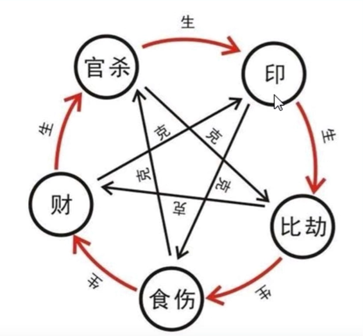

## 看发财的核心原则

- 身强财旺：遇大运流年，见食伤财才则发大财
- 身强财弱：遇大运流年，见食伤财才则发中财
- 身弱财旺：遇大运流年，见印枭比劫则发大财
- 身弱财弱：遇大运流年，见印枭比劫则发中财
- 四柱无财身又弱：不好发财，俗称和尚命
- 四柱无财身强：遇大运流年，见财则有钱进账，但财不长久
- 不管身强身弱，遇库则发
- 合化刑冲的问题

## 十神相生相克

- 官杀生印
- 印生比劫
- 比劫生食伤
- 食伤生财
- 财生官杀

- 官杀克比劫
- 比劫克财
- 财克印
- 印克食伤
- 食伤克官杀