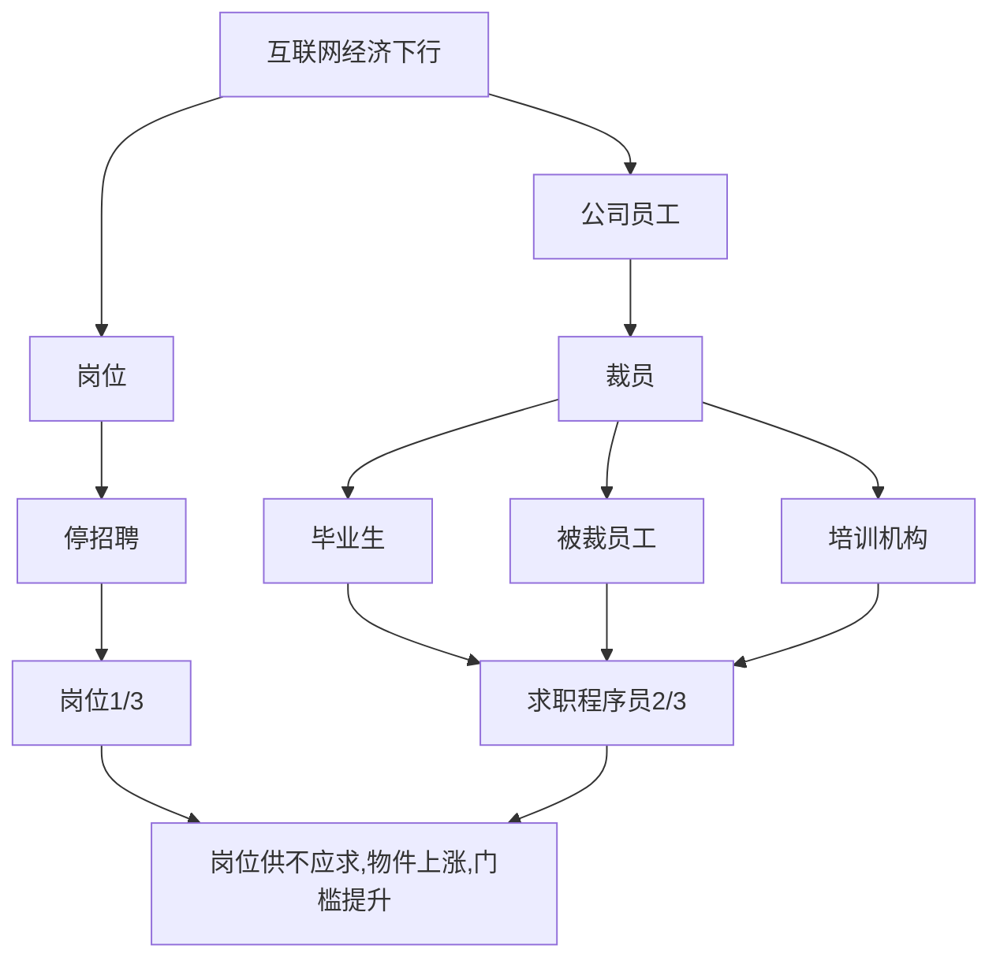
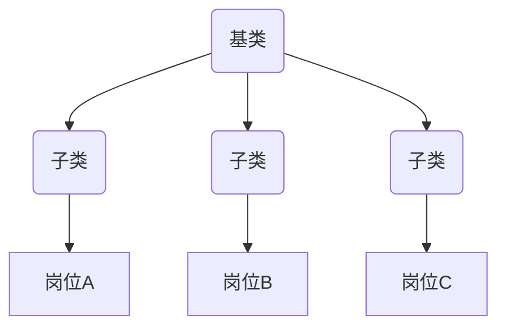

## 课程目录
1. 简历 - 铺好你的门面
2. 找职位 - 铺开各渠道
3. 首次沟通 - 信息收集
4. 面试前 - 针对性准备
5. 一面 - 突出技术根基
6. 二面 - 述说领域经验
7. 三面 - 体现综合能力
8. HR面 - 展现健康人格
9. 谈薪 - 自信不谦虚
10. 试用期 - 实现预期自我

### 简历 - 铺好你的门面
什么是简历 - 先罗衣后敬人
什么是简历 - **1**个核心目标: 用**最短时间**让面试官在人群中**发现**你, 并想**认识**你!

简历筛选流程 - 面试官 细简历
简历 => HR筛选入库(卡底线: 学历/学校/工作年限) => 入库 => 面试官捞简历(找上线: 学历/学校/工作年限) => 粗看简历(卡匹配度: 求职城市/薪资意向/技术领域)

简历筛选流程 - 制作原则
**弱化**底线 **无**干扰项 **放大**亮点
- 底线: 公司的最低要求, 一般由 HR 去把控, 如: 学校, 学历, 等等 **(弱化)**
- 干扰项: 可能会让面试官离开的信息, 如: 期望薪酬, 意向工作地, 等等 **删除**
- 亮点: 能留住面试官的信息, 如: 大厂经历, 大型应用经验, 拿过的奖, 等等 **放大**

### 如何写简历 - 个人信息
姓名: XXX 学校:    学校: XX大学(2015 ~ 2019)
手机:135xxxxxx98  邮箱: xxxxxxxx@qq.com

如何写简历 - 工作经历
起始年月日  公司名 - 部门   职位名称(职级)

如何写简历 - 项目经验
公司 - 项目名 (开始时间 ~ 结束时间)
描述: (简要提炼重点,让面试官快速了解**系统性质**与**规模**)
技术栈: (主要描述**你涉及**到的技术栈, 让面试官快速知道**你会什么**)

负责部分: (描述前端**团队规模**, 与你所**负责**的部分, 让面试官知道**你做了什么**, **占比**多重)

如何写简历 - 其他信息
1. 获奖情况
2. 个人项目
3. 参与过的开源项目
4. 发表过的文章
5. 参与过的业界分享

简历全貌
个人信息: 姓名, 手机, 邮箱, 学历(年份)
工作经历: 起始年份, 年份, 职位(职级)
项目经验: 公司, 项目名, 周期, 描述, 技术栈, 负责部分
其他信息: 奖项, 个人项目, 文章, 分享等等

### 找职位 - 铺开各渠道
情景分析 - 投递简历 石沉大海
1. 学校原因: 双非一本不被待见
2. 培训机构原因: 被歧视
3. 外包经历原因: 被歧视
4. 技术栈原因: vue落后了 要学 react
5. 工作年限原因: 都要3年以上

消极归因：教育背景（95%），其他（亮点没突出、投递不对、经验不匹配、基础不扎实、沟通不恰当占比5%）
理性归因：教育背景（45%），其他（亮点没突出、投递不对、经验不匹配、基础不扎实、沟通不恰当占比55%）

**抹掉**刻板认知 **塑造**独立思维
情景分析 - 时代大背景

情景分析 - 时代大背景
| 报名资格      | 职级           |
| -----------   | -----------   |
| 硕士/博士     |  王者          |
| 985/211本科   |  钻石          |
| 本科及以上    |  黄金          |
| 大专及以上    |  青铜          |

10年职业规划
认清自己**水平**，处于什么**阶段**，有什么职业**诉求**，对自己有清晰**定位**。
例：
| 诉求               | 目标职位                                           | 耗时    |
| -----------       | -----------                                        | -----   |
| 工作经验 + 项目经验 | 有学习机会，能接触到更多项目，2年后拿到18k以上的offer | 2       |
| 18k 以上的offer    | 能独当一面，独立负责系统，三年后进入大厂              | 3       |
| 进入一线大厂        | 大厂，且进入较好业务，持续工作下去，晋升              | 5       |

简历投递流程
1. 选岗位
2. 了解岗位信息
3. 调整简历
4. 复盘

简历投递流程 - 选岗位
1. 内推渠道
2. 猎头渠道
3. 企业官网
4. 招聘APP

简历投递流程 - 选岗位
内推渠道
特点：职场人脉（同学，校友，同事，朋友，前端社群，脉脉...）
关键：内推到自己所在的团队，最好直接是团队Leader，否则和自己投递没区别。（很重要）
优势：
1. 面试前能深入了解团队技术栈，业务细节。
2. 能更直接跟进面试情况。
3. 有团队成员背书，遇到横向对比时，增加成功率。

简历投递流程 - 选岗位
猎头渠道
特点：中高端岗位。
关键：猎头必须投递公司s级合作方，或长期与该公司合作（很重要）
又是：
1. 了解这家公司的招聘背景，岗位紧急程度，以往通过率等等，给到你指引。
2. 会有更多这家公司的面试题库，能做更针对性的面试前准备。
3. 面试成功，能协助你谈到一个较好的offer。
4. 面试失败，能协调你到其他岗位，再走流程。

简历投递流程 - 选岗位
内推 vs 猎头
内推：工作年限 **<5年**, P7以**下**, 找**你需要**的岗位
猎头: 工作年限 **>5年**, P7以**上**, 找**需要你**的岗位

简历投递流程- 选岗位
企业招聘官网
缺乏主动沟通环节,除非你特别优秀,否则**不太建议**直接投递

简历投递流程 - 了解岗位学习
**穷尽**办法**收集**岗位信息,包括但不限于: 业务, 技术栈, 紧急程度, 面试题, 面试官等等

简历投递流程- 调整简历
面向对象建简历

简历投递流程 - 复盘
追问 -> 分析 -> 改进

简历 
-> HR筛选入库(我们要求本科以上, 你不太合适;
我们需要5年工作经验以上的, 你不太适合;
我们要求需要有React开发经验的, 你不太适合;
我们需要有985/211的,你不太适合) -> 入库 -> 面试官捞简历(用人部门还没有回应; 再等等还没反馈) 
-> 粗看简历(你工作地必须是XX吗?
你对薪酬的要求必须是XX吗?
你对岗位的要求必须是XX吗?)
-> 细看简历(看了你的项目经历,和我们的岗位不太匹配;
我们这边还是找有做编辑器经验的人,你不太匹配;
我们希望曾经有做tob经验的同学,你不太匹配) -> 发起面试

课程总结
1. 塑造独立思维
2. 明确职业规划
3. 简历投递心得分享

电话邀约面试
HR(确认面试时间) -> 候选人 -> 信息收集 -> 准备面试看八股文,刷程序题 

历史视觉 - 孙子兵法
上兵伐谋(谋略) 其次伐交(外交) 其次伐兵(动武) 其下攻城(攻城)

现代军事视觉
航母战斗群(覆盖2000公里)
歼20(覆盖范围?)

投资视觉
第一层(2年前 获取100%信息)
第二层(1年前 获取80%信息)
第三层(半年前 获取50%信息)
...
第38层(现在获取20%信息)

自己经验
我(收纳1、2、3、4、5班考试资料) -> 考试

求职场景
信息**收集**得更多, 具备领先别人的**条件**
信息**分析**得更**准**, 具备领先别人的**能力**

招聘本质
找更强的 ×
找更匹配的 √

匹配案例
岗位薪酬:15k ~ 20k
培训班毕业同学 ×
能力到达40k ~ 50k的同学 ×
2 ~ 3年中厂工作经验同学

**收集**岗位信息 **判断**岗位核心诉求 **调整**自己为岗位匹配者
1. 沟通能力
2. 分析判断能力

环节分析 - 采集岗位信息
HR
  - 关系转变: 对立 -> 同盟
  - 电话收集: 部门、小组、业务
  - 微信收集: 发展史、团队规模、竞品、企业文化、遇到困难、面试官风格等等
猎头
  - 收集: 面试成功案例, 过往面试题, 面试官风格等等.
朋友
  - 收集: 团队氛围, Leader风格, 加班情况, 面试官风格等等

环节分析 - 分析岗位核心诉求
技术栈
  - 判断: Vue / React ? Element-ui? node? 前后端如何协作
什么端
  - 判断: PC / 移动端 / 原生?各有什么注意事项?
用户群体
  - 判断: 人群特点, 人群与业务是否契合, 会有什么问题?
团队组成
  - 判断: 自己的核心程度,承担多大工作量?

课程总结
1. **信息差**的重要性
2. 招聘的本质: 找到**更匹配的**人
3. 面试前准备: **采集**信息 - **分析**诉求 - **调整**自己
4. 培养能力: **沟通**能力、**分析判断**能力

岗位核心诉求
技术诉求
- 需要你懂什么: Vue / React / Uniapp ? PC / 移动端 / 小程序 / 原生 ? nodejs / Java?
能力诉求
- 需要你做什么: 带团队? 项目负责人? 核心研发? 普通研发?
业务(经验)诉求
- 需要做过什么: toB? toC? 自媒体? 游戏? 图片处理? 性能优化? 中台建设?
成本诉求
- 需要多少成本: 8k? 10k? 15k? 20k? 30k? 40k? 55k? 70k?

诉求: 需要用**A成本**, 请一个懂**B技术**, 有**C经验**, 具备**D能力**的人
回答: 我就是懂**B技术**, 有**C经验**, 具备**D能力**, 能接受**A成本**的人

面试前的准备
1. 自我介绍
2. 复习基础
3. 针对性技术准备
4. 针对性项目准备
5. 业务建议

自我介绍 - 社招
正常换工作
你好, 我XX年毕业于XX学校, 有XX年工作经验, 主要在XX公司工作, 技术栈主要是 **${B技术}**, 开发的项目主要是 **${C经验}**, 在过去团队中, 主要承担的任务是 **${D能力}**

毕业后空窗期找工作
你好, 我XX年毕业于XX学校, XX专业, 技术栈主要是 **${B技术}**, 过去一段时间, 主要个人开发为主, 开发过的项目主要是 **${C经验}**, 个人从0到1搭建XX项目, 具备 **${D能力}**

培训机构毕业找工作
你好, 我XX年毕业于XX学习, XX专业, 学习的主要是 **${B技术}**, 过程中参与开发过的项目主要是 **${C经验}**, 在培训团队中, 主要承担的任务是 **${D能力}**

应届毕业生 / 实习生
你好, 我XX年毕业于XX学校, XX专业, XX月份毕业, 我个人对前端有比较大的兴趣, 所以,处理好本专业课程以外, 还自学了前端, 参与了学校XX团队XX年, 用到的技术栈主要是 **${B技术}**, 开发的项目主要是**${C经验}**, 在过去团队中, 主要承担的任务是 **${D能力}**

复习基础
学习能力
解决问题能力

复习基础
第一层: 数据结构 + 计算机网络 + 设计模式
第二层: JavaScript + HTML + CSS
第三层: 框架原理 + 工程化 + 前端运维
第四层: nodejs + Mysql

针对性技术准备
突出**技术**匹配度

针对性技术准备
过往面试题目(信息来源: 猎头)
覆盖: 扫一遍题目, 透彻理解, 且准备最佳答案
延展: 以题目为圆心, 覆盖周边延展题目

面试官风格(信息来源: 猎头, 朋友)
喜欢问概念: 多复习八股文, 刷题, 背面试题
喜欢问实践: 多回顾复盘曾经做过的项目

技术栈(信息来源: JD, 朋友)
框架/工具: 了解对应原理, 回顾实践中的问题, 优化过的经验(知乎, 掘金)

针对性项目准备
选出与岗位诉求匹配的项目
项目描述: 通过无差别录制用户行为, 以便有问题时能快速还原问题现场, 解决Tob私有化部署客户问题难定位问题
个人负责: 系统负责人, 一人独立完成
项目难点: 前端无差别录制会导致前端卡顿
业界方案: 减少记录数据、用indexDB存储、数据合并、web-worker
如何解决: 卡顿本质是计算线程阻塞了渲染线程, 通过webworker + indexDB的方案, web-worker完成计算, 让渲染线程保持通畅
解决效果: 从卡顿到近乎无感知

业务建议
对业务的了解
对行业竞品的了解
对该行业的经验
业务可能遇到的问题
对该业务的建议

课程总结
懂**B技术**, 有**C经验**, 具备**D能力**, 能接受**A成本**的人
自我介绍
前端4层学习体系
针对性的技术/项目/业务准备

一面 - 突出技术根基

面试要素
本质认知
  - 和面试官PK ×
  - 获得HR认可 ×
  - 表现得比其他面试者更优秀 √

心态
  - 去考试 ×
  - 去交流 √

姿态
  - 被盘问 ×
  - 技术交流 √
  - 知识分享 √√

面试官
  细节 ----> 宏观

面试技巧
话术: **八股文**(依赖知识图谱) + **自己看法** + **自己经验**(依赖信息收集)
引导: 引向自己**熟悉**的领域(依赖简历制作)

场景与话术
懂原理 + 有经验: 八股文 + 自己见解 + 自己经验
懂原理 + 没经验: 八股文 + 行业方案
不懂原理 + 有经验: 直接分享经验
不懂原理 + 没经验: 找相似 / 直接告知不会, 记下, 整理到知识图谱

编码题目
懂: 编码 + 思路分享
不懂: 咨询边界值 + 思路分享 / 直接告知不懂

面试官目的
**挖掘**候选的技术能力, 判断与岗位**匹配度**

一面回顾
一面面试官: 一线研发
二面面试官: 团队leader

二面 - 诉说领域经验
核心考察
靠擦点1: 过往的业务**经验**和我们是否**匹配**?
电商管理系统: 订单管理, 仓储管理, 营销管理, 秒杀抢购, 物流跟踪等等
移动端页面: 多机型适配, 加载性能, 体验新能, 虚拟列表, 滚动防抖, 预加载, 懒加载等等
TOB中后台系统: 较强的抽象能力, 应对不同客户定制化需求, 问题跟进, 工单跟进等等

考察点2: 业务能力(做事能力)
根据已有的**知识体系**, 结合**业务**, 是否有形成自己成熟的做事**方法论**
而该方法论是否全面, 包含考虑到项目的稳定性, 安全性,可拓展性, 可维护性, 持续集成成本等等

我们要做什么
1. 告诉面试官, 我做了什么**事情**, 这个事情属于什么**业务类型**

做事思维方式
**遇到**什么需求 / 问题 + **业界**解决方案 + **我的**解决方案 + **落地** 效果

例:挑战点 -- **灵活高效**支撑多触达场景
问题: 客户间有**不同**的触达场景, 且**定制化**程度高, 难以**灵活**应对, 一对一开发影响交付**效率**
挑战点: 如何**灵活、高效**支撑多触达场景,降低成本, 提高效率
分析思考: 客户需求虽各异, 但万变不离"**人-货-场**" (把特定货品, 在特定场景, 推送给特定人群)
业界方案: 
方案A: **大而全**的触达系统, **标准化**流程(行业参考: 神策, 易观)
方案A问题: 1. 不适合**多客户**交付场景; 
2. 交付时**冗余**过多无用能力; 
3. **定制化**拓展能力弱, 往往牺牲客户需求; 
4. 跟随迭代, **熵增**明显

方案B: **多个**子系统配合, **灵活**配置各个运营场景
方案B问题:
1. 不适合**外部客户私有化**交付场景
2. 通过建站能力不适用于**领域性较强**的场景
3. 过分灵活, 搭建复杂, 并无**实质性提效**
4. 未能**体系化**解决触达领域问题

折中解决方案
粒度: 算子服务 + AOP: 领域建模 + 面向对象建站

挑战点 -- **灵活高效**支撑多触达场景: 算子服务
算子服务: 描述"人货场"的基本单元, 组成系统的最小粒度, 一种**可复用**的**系统能力**

触达领域"人货场"基本单元
算子服务结构
前端组件: page, 样式, 交互, 网络请求
服务逻辑: 写库, 读库, 加工, 第三方依赖
离线逻辑: 召回, 过滤, 排序, 离线计算
DB存储: 数据结构, 存储场景
钩子: 页面钩子, 组件钩子, 后端钩子

前端组件: 决定算子前端样式与交互, 网络请求
服务逻辑: 决定算子的存储逻辑, 依赖方
计算逻辑: 决定算子离线行为, 计算逻辑
DB存储: 决定算子存储结构, 存储场景
钩子: 算子能重载, 想通过**定制化**能力保证

挑战点 -- **灵活高效**支撑多触达场景: 面向切片领域建模(AOP)
领域模型: 由算子拼装而成, 一种**可复用**的**通用业务能力**, 可重复**生成**多个营运系统

挑战点 -- **灵活高效**支撑多触达场景: 面向对象建站, 平衡通用与定制化
营运系统(**交付**客户)
派生自领域模型, 针对客户需求定制化的营运系统, 交付客户的最终产品

通用能力**复用**
通过领域模型, 保证领域通用能力可复用, 节省重复开发人力成本

模型**定制化拓展**
依据面向对象"继承" "重载"等设计思想, 通过算子的拓展, 实现领域模型拓展, 灵活高效支持多客户场景

关键要素
封装: 一个类是多个算子的集合
继承: 子类拥有父类所包含算子, 且能动态添加新算子
多态: 算子可重载(钩子能力)

案例:消息推送模型->实例化(领域模型支持**插拔式**组装算子, 算子支持各种**钩子**, 有效应对客户各种**定制化**需求)

消息推送 - 领域模型(领域模型沉淀通用业务能力, 保证高**复用性**, 大幅降低重复开发成本)
包含: 消息内容, 触发点, 业务条件, 人群定向

挑战点 -- **灵活高效**支撑多触达场景: 最终解决方案

算子->算子服务->算子服务库->算子库->领域模型->面向对象建站

挑战点 -- **灵活高效**支撑多触达场景: 落地效果
提效情况(**高效**)
1. 开发系统=>开发算子 + 领域**建模**
2. 一个算子的平均开发时间为5天/人
3. 算子库可多人持续集成, 人力成本**边际效应**明显

交付情况(**灵活**)
1. 1年, 孵化领域模型**8**个, 营运系统**30+**
2. 插入客户**24**个, 其中内部客户**13**个, 外部客户**11**个

移动端列表页
挑战点: 当用户往下滚动加载数据, 数据会越来越多, 页面会卡顿
业界方案: 通过预加载, 懒加载的方式优化列表, 但是没很好解决卡顿问题
我的方案: 当数据量超过阈值的时候, 切换为虚拟列表. 譬如加载超过1000条数据的时候, 无感知切换到虚拟列表, 始终只加载前后100条数据
落地效果: 前端列表无限加载都无感知

后台管理系统
挑战点: 都是用UI框架搭建模块, 研发都在做CRUD体力活, 很浪费研发资源
业界方案: 通过低代码平台处理, 但是你们人力有限, 项目也不大, 要构建一个低代码平台成本比较高
我的方案: 分析得出, 每个模块其实基本功能都很类似, 都是有搜索框, 列表, 修改增加弹框, 翻页. 我就通过沉淀出这类模板, 并且暴露各参数, 使得有重复功能模块上线的时候, 直接通过配置即可生成板块,
大大地提升研发效率, 同时也不会浪费研发资源制作CRUD的体力活事情
落地效果: 同类型模块只需配置即可, 开发一个模块的人力从3人/天, 降低到1人/天

门户页面
挑战点: 需要经常和后端对接口, 经常需要耗费时间等联调, 影响效率
业界方案: 通过模拟数据, 或者开发中写死等等, 但是这样需要额外去整理mock数据, 而且当结构变动的时候很难保持同步, 没有可维护性
我的方案: 通过构造一套data-mocker服务, 前后端之间的沟通就通过data-mocker完成, data-mocker相当于一个API工具, 双方在系统上协商好api, data-mocker就会充当一个媒介,
前端开发完就可以请求data-mocker返回模拟数据, 后端先开发完, 就可以利用data-mocker发起请求
落地效果: 前后端联调不再互相依赖, 都以data-mocker作为媒介, 有效的提升效率. 前后端研发不再会因为API调整而增加更多的额外沟通成本

一个功能模块
挑战点: 这个组件非常特殊, 产品总是对这个产品的需求进行高频调整
业界方案: 为模块提供其多的开放性配置, 应多产品经理的诉求, 但这样会极大增加维护成本
我的方案: 写好模块的模板, 同时模板中留出很多的slot插槽, 同时收拢一个组件库, 用 公用组件 + 插槽 + 模板 的方案, 解决高频变动模块
落地效果: 就算频繁变动, 也不会额外增加我更多的工作量

