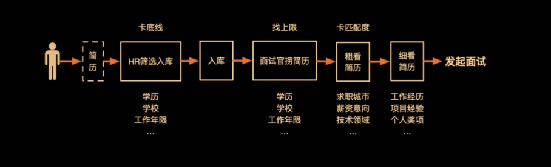
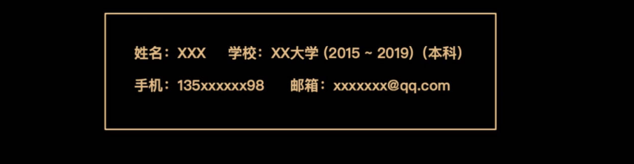
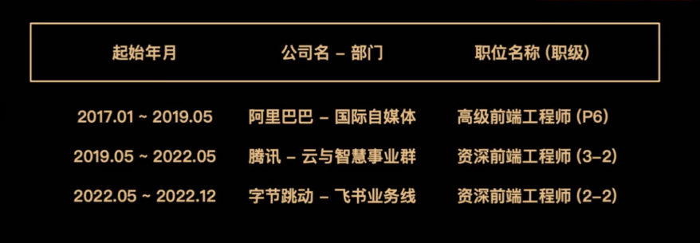
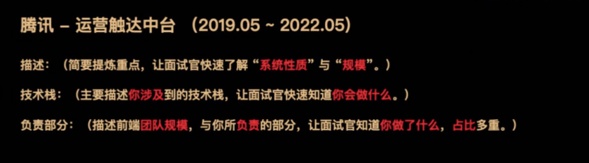

## 什么是简历

先罗衣后敬人, 在求职过程中,简历是你与招聘方第一次接触的关键环节。一份出色的简历不仅能引起 HR 的关注,更能展现你的专业技能和个人特质,为你赢得面试的机会。

**核心目标**

用**最短时间**让面试官在人群中**发现**你, 并想**认识**你!

## 简历筛选流程

**制作原则**

- **弱化**底线 **无**干扰项 **放大**亮点
- 底线: 公司的最低要求, 一般由 HR 去把控, 如: 学校, 学历, 等等 **(弱化)**
- 干扰项: 可能会让面试官离开的信息, 如: 期望薪酬, 意向工作地, 等等 **(删除)**
- 亮点: 能留住面试官的信息, 如: 大厂经历, 大型应用经验, 拿过的奖, 等等 **(放大)**

## 如何写简历

**个人信息**

**工作经历**

**项目经验**

**其他信息**

- 获奖情况
- 个人项目
- 参与过的开源项目
- 发表过的文章
- 参与过的业界分享

**简历全貌**

- 个人信息: 姓名, 手机, 邮箱, 学历(年份)
- 工作经历: 起始年份, 年份, 职位(职级)
- 项目经验: 公司, 项目名, 周期, 描述, 技术栈, 负责部分
- 其他信息: 奖项, 个人项目, 文章, 分享等等
