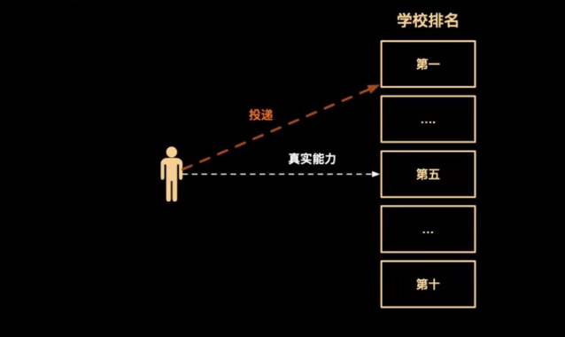
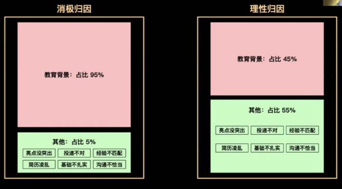
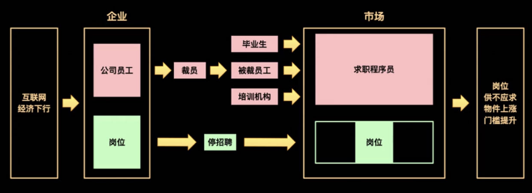
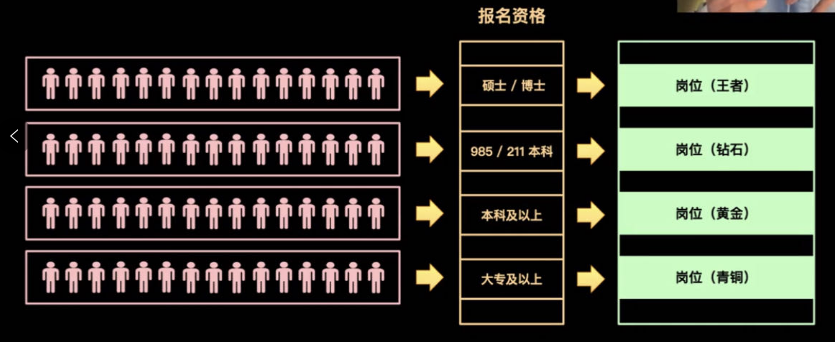
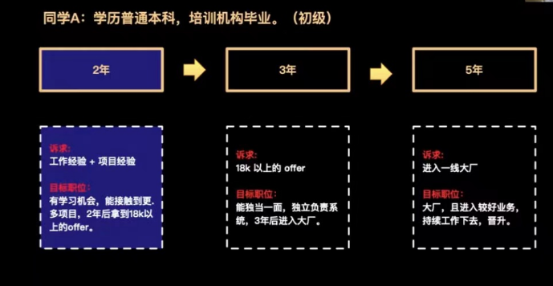
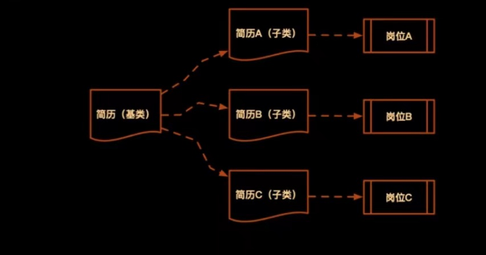
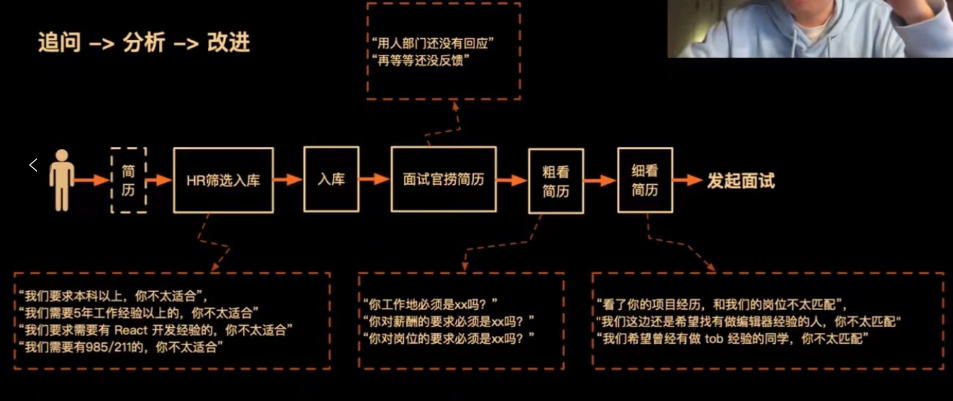

## 投递简历的重要性

## 情景分析

**投递简历 石沉大海**

- 学校原因: 双非一本不被待见
- 培训机构原因: 被歧视
- 外包经历原因: 被歧视
- 技术栈原因: vue 落后了 要学 react
- 工作年限原因: 都要 3 年以上

**时代大背景**

**抹掉**刻板认知 **塑造**独立思维

## 如何找到合适的赛道

**10 年职业规划**

认清自己**水平**，处于什么**阶段**，有什么职业**诉求**，对自己有清晰**定位**。

## 简历投递流程

### 选岗位

**内推渠道**

- 特点：职场人脉（同学，校友，同事，朋友，前端社群，脉脉...）
- 关键：内推到自己所在的团队，最好直接是团队 Leader，否则和自己投递没区别。（很重要）

**优势：**

1. 面试前能深入了解团队技术栈，业务细节。
2. 能更直接跟进面试情况。
3. 有团队成员背书，遇到横向对比时，增加成功率。

**猎头渠道**

- 特点：中高端岗位。
- 关键：猎头必须投递公司 s 级合作方，或长期与该公司合作（很重要）
  又是：

1. 了解这家公司的招聘背景，岗位紧急程度，以往通过率等等，给到你指引。
2. 会有更多这家公司的面试题库，能做更针对性的面试前准备。
3. 面试成功，能协助你谈到一个较好的 offer。
4. 面试失败，能协调你到其他岗位，再走流程。

**内推 vs 猎头**

- 内推：工作年限 **<5 年**, P7 以**下**, 找**你需要**的岗位
- 猎头: 工作年限 **>5 年**, P7 以**上**, 找**需要你**的岗位

**企业招聘官网**

缺乏主动沟通环节,除非你特别优秀,否则**不太建议**直接投递

### 了解岗位学习

**穷尽**办法**收集**岗位信息,包括但不限于: 业务, 技术栈, 紧急程度, 面试题, 面试官等等

### 调整简历

面向对象建简历

### 复盘

## 课程总结

- 塑造独立思维
- 明确职业规划
- 简历投递心得分享
