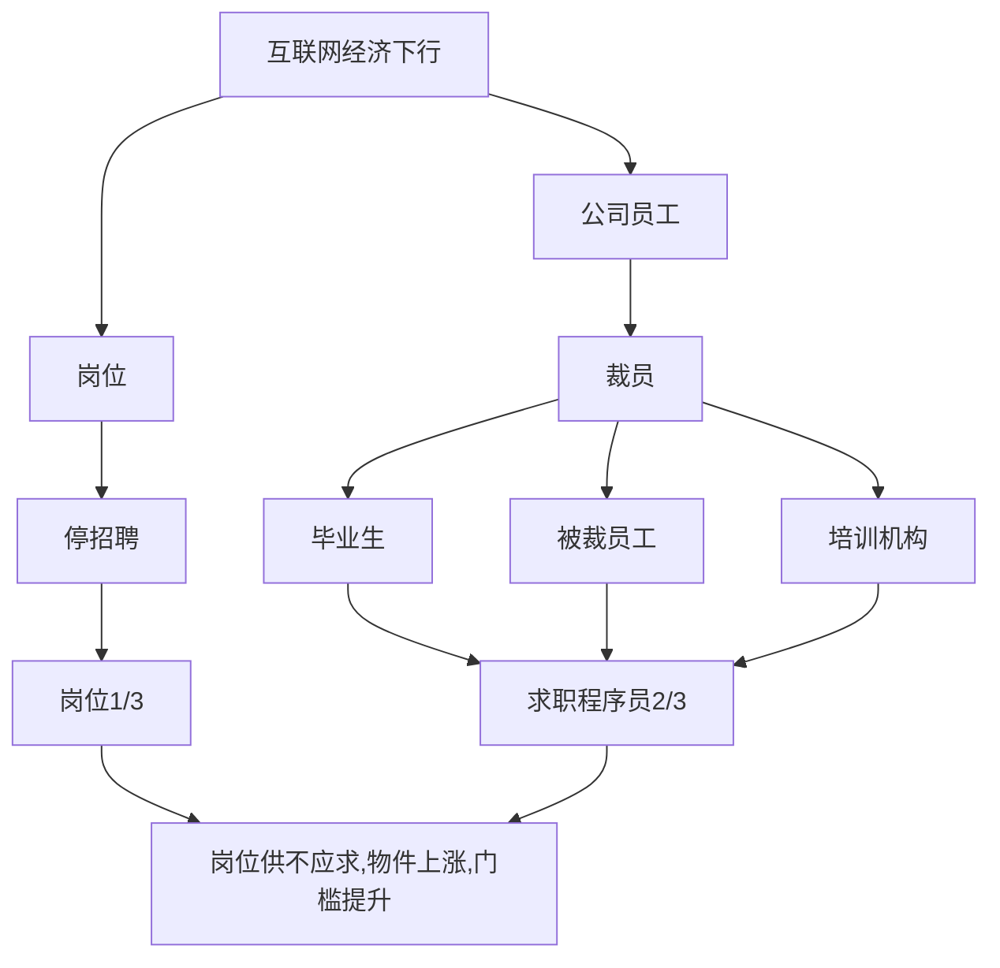
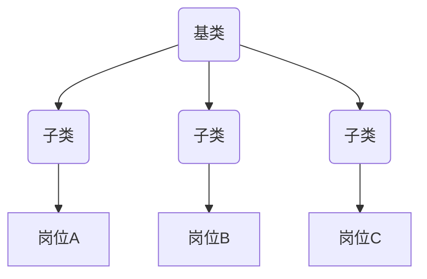

情景分析 - 投递简历 石沉大海

1. 学校原因: 双非一本不被待见
2. 培训机构原因: 被歧视
3. 外包经历原因: 被歧视
4. 技术栈原因: vue 落后了 要学 react
5. 工作年限原因: 都要 3 年以上

消极归因：教育背景（95%），其他（亮点没突出、投递不对、经验不匹配、基础不扎实、沟通不恰当占比 5%）
理性归因：教育背景（45%），其他（亮点没突出、投递不对、经验不匹配、基础不扎实、沟通不恰当占比 55%）

**抹掉**刻板认知 **塑造**独立思维
情景分析 - 时代大背景

情景分析 - 时代大背景
| 报名资格 | 职级 |
| ----------- | ----------- |
| 硕士/博士 | 王者 |
| 985/211 本科 | 钻石 |
| 本科及以上 | 黄金 |
| 大专及以上 | 青铜 |

10 年职业规划
认清自己**水平**，处于什么**阶段**，有什么职业**诉求**，对自己有清晰**定位**。
例：
| 诉求 | 目标职位 | 耗时 |
| ----------- | ----------- | ----- |
| 工作经验 + 项目经验 | 有学习机会，能接触到更多项目，2 年后拿到 18k 以上的 offer | 2 |
| 18k 以上的 offer | 能独当一面，独立负责系统，三年后进入大厂 | 3 |
| 进入一线大厂 | 大厂，且进入较好业务，持续工作下去，晋升 | 5 |

简历投递流程

1. 选岗位
2. 了解岗位信息
3. 调整简历
4. 复盘

简历投递流程 - 选岗位

1. 内推渠道
2. 猎头渠道
3. 企业官网
4. 招聘 APP

简历投递流程 - 选岗位
内推渠道
特点：职场人脉（同学，校友，同事，朋友，前端社群，脉脉...）
关键：内推到自己所在的团队，最好直接是团队 Leader，否则和自己投递没区别。（很重要）
优势：

1. 面试前能深入了解团队技术栈，业务细节。
2. 能更直接跟进面试情况。
3. 有团队成员背书，遇到横向对比时，增加成功率。

简历投递流程 - 选岗位
猎头渠道
特点：中高端岗位。
关键：猎头必须投递公司 s 级合作方，或长期与该公司合作（很重要）
又是：

1. 了解这家公司的招聘背景，岗位紧急程度，以往通过率等等，给到你指引。
2. 会有更多这家公司的面试题库，能做更针对性的面试前准备。
3. 面试成功，能协助你谈到一个较好的 offer。
4. 面试失败，能协调你到其他岗位，再走流程。

简历投递流程 - 选岗位
内推 vs 猎头
内推：工作年限 **<5 年**, P7 以**下**, 找**你需要**的岗位
猎头: 工作年限 **>5 年**, P7 以**上**, 找**需要你**的岗位

简历投递流程- 选岗位
企业招聘官网
缺乏主动沟通环节,除非你特别优秀,否则**不太建议**直接投递

简历投递流程 - 了解岗位学习
**穷尽**办法**收集**岗位信息,包括但不限于: 业务, 技术栈, 紧急程度, 面试题, 面试官等等

简历投递流程- 调整简历
面向对象建简历

简历投递流程 - 复盘
追问 -> 分析 -> 改进

简历
-> HR 筛选入库(我们要求本科以上, 你不太合适;
我们需要 5 年工作经验以上的, 你不太适合;
我们要求需要有 React 开发经验的, 你不太适合;
我们需要有 985/211 的,你不太适合) -> 入库 -> 面试官捞简历(用人部门还没有回应; 再等等还没反馈)
-> 粗看简历(你工作地必须是 XX 吗?
你对薪酬的要求必须是 XX 吗?
你对岗位的要求必须是 XX 吗?)
-> 细看简历(看了你的项目经历,和我们的岗位不太匹配;
我们这边还是找有做编辑器经验的人,你不太匹配;
我们希望曾经有做 tob 经验的同学,你不太匹配) -> 发起面试

课程总结

1. 塑造独立思维
2. 明确职业规划
3. 简历投递心得分享
