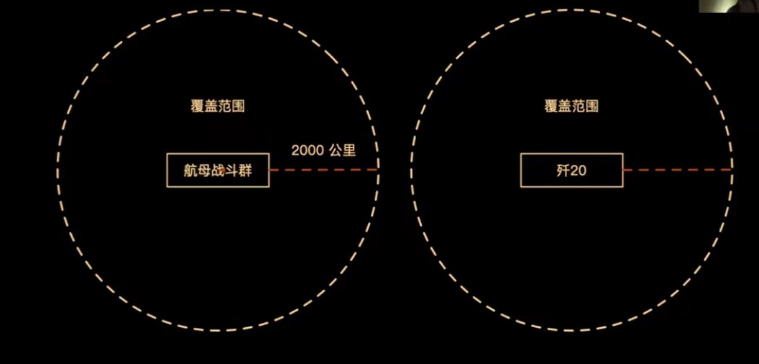
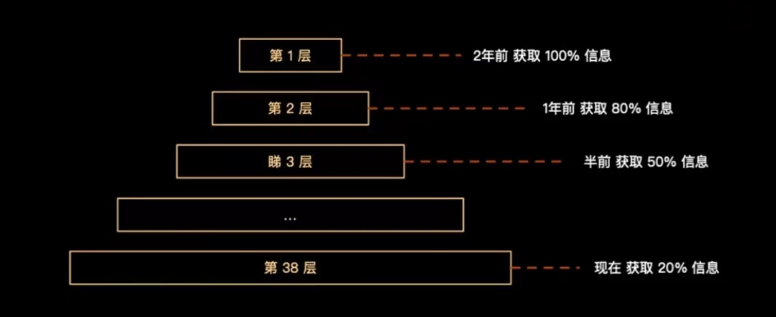
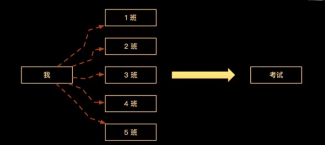
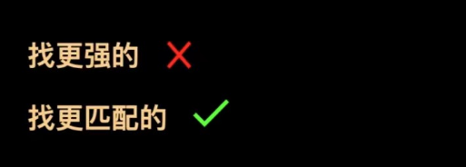
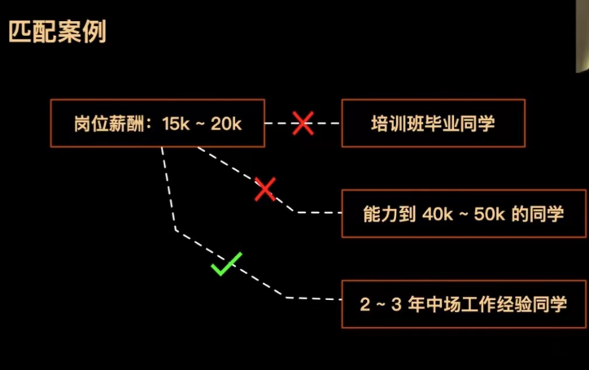

HR(确认面试时间) -> 候选人 -> 信息收集 -> 准备面试看八股文,刷程序题

## 信息差重要性

**历史视觉 - 孙子兵法**

上兵伐谋(谋略) 其次伐交(外交) 其次伐兵(动武) 其下攻城(攻城)

**现代军事视觉**

**投资视觉**

**自己经验**

**求职场景**

- 信息**收集**得更多, 具备领先别人的**条件**
- 信息**分析**得更**准**, 具备领先别人的**能力**

## 招聘的本质

## 培养能力

**收集**岗位信息 **判断**岗位核心诉求 **调整**自己为岗位匹配者

- 沟通能力
- 分析判断能力

## 面试前准备

### 采集岗位信息

**HR**

- 关系转变: 对立 -> 同盟
- 电话收集: 部门、小组、业务
- 微信收集: 发展史、团队规模、竞品、企业文化、遇到困难、面试官风格等等

**猎头**

- 收集: 面试成功案例, 过往面试题, 面试官风格等等.

**朋友**

- 收集: 团队氛围, Leader 风格, 加班情况, 面试官风格等等

### 分析岗位核心诉求

**技术栈**

- 判断: Vue / React ? Element-ui? node? 前后端如何协作
  什么端
- 判断: PC / 移动端 / 原生?各有什么注意事项?

**用户群体**

- 判断: 人群特点, 人群与业务是否契合, 会有什么问题?

**团队组成**

- 判断: 自己的核心程度,承担多大工作量?

课程总结

1. **信息差**的重要性
2. 招聘的本质: 找到**更匹配的**人
3. 面试前准备: **采集**信息 - **分析**诉求 - **调整**自己
4. 培养能力: **沟通**能力、**分析判断**能力
