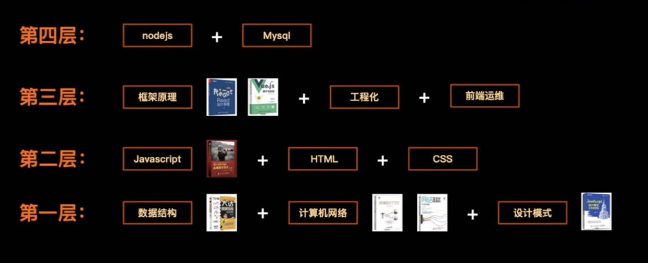
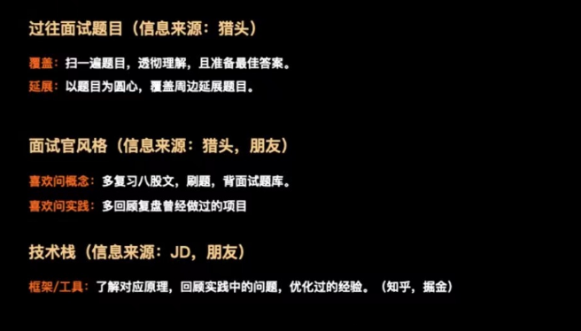

## 岗位核心诉求

**技术诉求**

- **需要你懂什么**: Vue / React / Uniapp ? PC / 移动端 / 小程序 / 原生 ? nodejs / Java?

**能力诉求**

- **需要你做什么**: 带团队? 项目负责人? 核心研发? 普通研发?

**业务(经验)诉求**

- **需要做过什么**: toB? toC? 自媒体? 游戏? 图片处理? 性能优化? 中台建设?

**成本诉求**

- **需要多少成本**: 8k? 10k? 15k? 20k? 30k? 40k? 55k? 70k?

**公式**

- 诉求: 需要用**A 成本**, 请一个懂**B 技术**, 有**C 经验**, 具备**D 能力**的人
- 回答: 我就是懂**B 技术**, 有**C 经验**, 具备**D 能力**, 能接受**A 成本**的人

## 面试前的准备

### 自我介绍

**正常换工作**

你好, 我 XX 年毕业于 XX 学校, 有 XX 年工作经验, 主要在 XX 公司工作, 技术栈主要是 `${B 技术}`, 开发的项目主要是 `${C 经验}`, 在过去团队中, 主要承担的任务是 `${D 能力}`

**毕业后空窗期找工作**

你好, 我 XX 年毕业于 XX 学校, XX 专业, 技术栈主要是 `${B 技术}`, 过去一段时间, 主要个人开发为主, 开发过的项目主要是 `${C 经验}`, 个人从 0 到 1 搭建 XX 项目, 具备 `${D 能力}`

**培训机构毕业找工作**

你好, 我 XX 年毕业于 XX 学习, XX 专业, 学习的主要是 `${B 技术}`, 过程中参与开发过的项目主要是 `${C 经验}`, 在培训团队中, 主要承担的任务是 `${D 能力}`

**应届毕业生 / 实习生**

你好, 我 XX 年毕业于 XX 学校, XX 专业, XX 月份毕业, 我个人对前端有比较大的兴趣, 所以,处理好本专业课程以外, 还自学了前端, 参与了学校 XX 团队 XX 年, 用到的技术栈主要是 `${B 技术}`, 开发的项目主要是`${C 经验}`, 在过去团队中, 主要承担的任务是 `${D 能力}`

**复习基础**

**针对性技术准备**

**针对性项目准备**

选出与岗位诉求匹配的项目

- 项目描述: 通过无差别录制用户行为, 以便有问题时能快速还原问题现场, 解决 Tob 私有化部署客户问题难定位问题
- 个人负责: 系统负责人, 一人独立完成
- 项目难点: 前端无差别录制会导致前端卡顿
- 业界方案: 减少记录数据、用 indexDB 存储、数据合并、web-worker
  如何解决: 卡顿本质是计算线程阻塞了渲染线程, 通过 webworker + indexDB 的方案, web-worker 完成计算, 让渲染线程保持通畅
- 解决效果: 从卡顿到近乎无感知

**业务建议**

- 对业务的了解
- 对行业竞品的了解
- 对该行业的经验
- 业务可能遇到的问题
- 对该业务的建议

## 课程总结

懂**B 技术**, 有**C 经验**, 具备**D 能力**, 能接受**A 成本**的人

- 自我介绍
- 前端 4 层学习体系
- 针对性的技术/项目/业务准备
