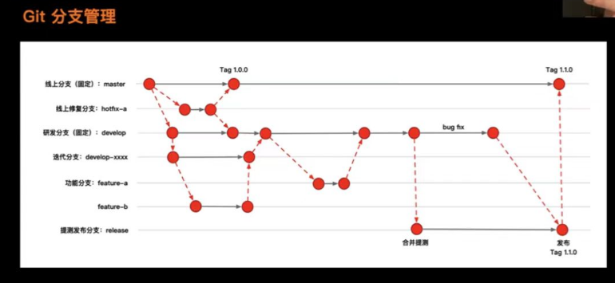

## 三面是什么

- 本质：宏观，通过率比前面高，针对核心研发、高 P、管理层来设计。
- 关注：知识体系、做事体系、能否 hold 住一个业务。
- 回答：暗示你能 hold 住这个事情，你能带领大家 hold 住这个事情。

## 体系化技术思维案例

**案例一：性能优化**

- 加载性能
  - **体量维度（工程化，代码设计）**： 资源压缩；模块化，利用路由，按需加载依赖；组件化，加载最小依赖；等等。
  - **网络维度**：减少 tcp 连接次数，减少 3 次握手；减少外部服务 http 请求数；开启 gzip 传输；缓存；http-dns；等等。
  - **浏览器维度**：http 缓存协议（强/弱缓存）；PC 端域名发散；移动端域名收敛；等等。
  - **业务维度**：首屏服务器渲染，次屏浏览器渲染；懒加载，预加载；loading 无感知；等等。
- 体验性能
  - **本质**：计算线程不阻塞渲染线程；最小局部渲染，不回流；

**案例一：你工作中做过最成功的事**

项目 A：

- 遇到什么问题：xxxxx
- 业界如何解决：xxxxx
- 我的解决方案：xxxxx
- 落地效果如何：xxxxx

## 业务能力

对业务有深入理解，判断**可行性**，**风险评估**，评估**突破口**，等等。

## 团队管理

- 团队关系：恩威并施 / 平衡

解决**疑难杂症**的能力与**经验**

## 职业规划

- 希望团队能提供什么给你
- 你能为公司带来什么

## 你还有什么问题？

- 判断你是否通过
- 判断你的面评结果，为谈薪做准备。
- 判断你的职位，以及公司对你的定位。
