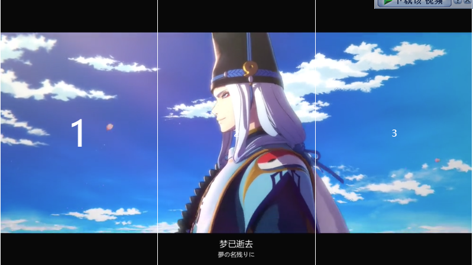

今天，给大家分享一个鼠标悬浮视频切换效果的实现。



效果很简单，移动到指定元素后切换视频。思路如下：

1. 使用 3 个 video 元素播放各自视频，隐藏未展示的视频元素。
2. 为每一项绑定鼠标移入效果
3. 给当前移入项添加 active 类，并移除其兄弟元素的 active 类。
4. 配合 active 项控制 video 的展示。


首选确认DOM结构：

```html
  <div class="video-box">
    <div class="video-item active">
      <span>1</span>
      <video src="./1.mp4" autoplay muted></video>
    </div>
    <div class="video-item">
      <span>2</span>
      <video src="./2.mp4" autoplay muted></video>
    </div>
    <div class="video-item">
      <span>3</span>
      <video src="./3.mp4" autoplay muted></video>
    </div>
  </div>
````

获取每一项元素并绑定 onmouseenter 事件：

```javascript
  const items = document.getElementsByClassName('video-item');
  for (let i = 0; i < items.length; i++) {
    const item = items[i];
    item.onmouseenter = function (e) {
      // 给当前移入项添加 active 类

      // 移除其兄弟元素的 active 类
    }
  }
```

给当前移入项添加 active 类：

```javascript
  item.classList.add('active');
```

然后我们定义一个获取兄弟元素的工具函数：

```javascript
  function getSiblings(node) {
    const siblings = [];
    let { previousSibling, nextSibling } = node;

    while (nextSibling) {
      if (nextSibling.nodeType !== 3) {
        siblings.push(nextSibling);
      }
      nextSibling = nextSibling.nextSibling;
    }

    while (previousSibling) {
      if (previousSibling.nodeType !== 3) {
        siblings.push(previousSibling);
      }
      previousSibling = previousSibling.previousSibling;
    }

    return siblings;
  }
```

移除其兄弟元素的 active 类:

```javascript
  const siblings = getSiblings(item);

  siblings.forEach(item => {
    item.classList.remove('active');
  })
```

配合 active 项控制 video 的展示。

```css
    .video-box .video-item.active video {
      opacity: 1;
    }
```

完整代码：

```html
<!DOCTYPE html>
<html lang="en">

<head>
  <meta charset="UTF-8">
  <meta name="viewport" content="width=device-width, initial-scale=1.0">
  <title>Document</title>
  <style>
    .video-box {
      position: relative;
      display: flex;
      width: 800px;
      height: 448px;
      margin: 50px auto;
      color: white;
    }

    .video-box .video-item {
      flex: 1;
      display: flex;
      justify-content: center;
      align-items: center;
      border-right: 1px solid white;
    }

    .video-box .video-item:last-child {
      border: 0;
    }

    .video-box .video-item video {
      position: absolute;
      left: 0;
      top: 0;
      width: 100%;
      height: 100%;
      z-index: -1;
      opacity: 0;
      transition: opacity 0.7s;
    }

    .video-box .video-item.active video {
      opacity: 1;
    }

    .video-box .video-item.active span {
      font-size: 60px;
    }
  </style>
</head>

<body>
  <div class="video-box">
    <div class="video-item active">
      <span>1</span>
      <video src="./1.mp4" autoplay muted></video>
    </div>
    <div class="video-item">
      <span>2</span>
      <video src="./2.mp4" autoplay muted></video>
    </div>
    <div class="video-item">
      <span>3</span>
      <video src="./3.mp4" autoplay muted></video>
    </div>
  </div>
</body>
<script>
  function getSiblings(node) {
    const siblings = [];
    let { previousSibling, nextSibling } = node;

    while (nextSibling) {
      if (nextSibling.nodeType !== 3) {
        siblings.push(nextSibling);
      }
      nextSibling = nextSibling.nextSibling;
    }

    while (previousSibling) {
      if (previousSibling.nodeType !== 3) {
        siblings.push(previousSibling);
      }
      previousSibling = previousSibling.previousSibling;
    }

    return siblings;
  }

  const items = document.getElementsByClassName('video-item');
  for (let i = 0; i < items.length; i++) {
    const item = items[i];
    item.onmouseenter = function (e) {
      const siblings = getSiblings(item);

      item.classList.add('active');

      siblings.forEach(item => {
        item.classList.remove('active');
      })
    }
  }

</script>

</html>
```
