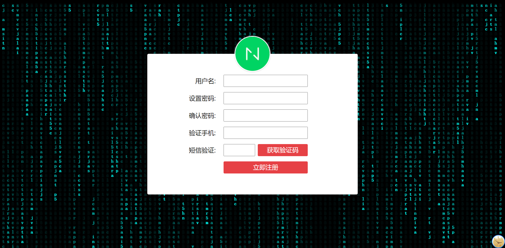

今天,给大家分享一个文字瀑布效果。效果展示如下：



直接说一下思路:

1. 给每一列绘制一个文字。
2. 修改y轴坐标，重复1步骤。

现在，我们开始代码的书写

首先我们要得到所需绘制的列数，以及一些所需元素准备：

```javascript
  const canvas = document.querySelector('canvas');
  const context = canvas.getContext('2d');
  const screenWidth = window.screen.availWidth;
  const screenHeight = window.screen.availHeight;
  const fontSize = 18;
  const col = Math.floor(screenWidth / fontSize);
```

另外还需要一段字符串和当前列的y轴坐标：

```javascript
  const coordinate = Array(col).fill(0);
  const str = 'javascript html5 canvas';
```

然后进行进行canvas元素的尺寸初始化：

```javascript
  canvas.width = screenWidth;
  canvas.height = screenHeight;
```

做好了这些，我们就可以进行 draw 方法定义了。

查看效果展示，可以很容易发现，先绘制的文字先隐藏，这是如何做到的呢？

```javascript
    context.fillStyle = 'rgba(0,0,0,0.05)';
    context.fillRect(0, 0, screenWidth, screenHeight);
```

实际就是使用一个透明的遮罩，当遮罩不断的叠加，原来绘制的内容就会被覆盖。

然后我们在开始文字绘制前，先重置一下绘制样式：

```javascript
    context.font = `800 ${fontSize}px 宋体`;
    context.fillStyle = '#01fef5';
```

样式准备好后，我们对所需的列进行遍历：

```javascript
    for (let i = 0; i < col; i++) {
      // 获取随机字符
      // 获取x和y的坐标
      // 绘制文字
    }
```

在循环中，获取随机字符，这里我们只获取字符所在字符串的索引值：

```javascript
      const index = Math.floor(Math.random() * str.length);
```

然后就是坐标值的获取

```javascript
      const x = i * fontSize;
      const y = coordinate[i] * fontSize;
```

x轴的可以由当前遍历的索引得出，y轴可以由 coordinate 得出。需要注意的是x轴和y轴的值都需要计算得出，因为 coordinate 缓存的是以 fontSize 为单位的数值，而每一列也是如此。

然后就可以调用 fillText 进行文字绘制了

```javascript
      context.fillText(str[index], x, y);
```

循环体内最后一个步骤，我们还需修改 coordinate 的值，已经进行边缘值处理。

```javascript
      if (y >= canvas.height && Math.random() > 0.88) {
        coordinate[i] = 0;
      }
      coordinate[i]++;
```

综上， draw 方法就定义完成。

为了方便控制绘制速度，我们使用 setInterval 进行调用 draw 。

```javascript
  draw();
  setInterval(draw, 30);
```

到此，文字瀑布的效果的代码编写就结束了。

最后，附上完整实现代码：

```html
<!DOCTYPE html>
<html lang="en">

<head>
  <meta charset="UTF-8">
  <meta name="viewport" content="width=device-width, initial-scale=1.0">
  <title>Document</title>
  <style>
    html {
      margin: 0;
      background: #000;
      overflow: hidden;
    }

    form {
      position: fixed;
      left: 50%;
      top: 50%;
      transform: translate(-50%, -50%);
      width: 800px;
      background: white;
      border-radius: 5px;
    }

    form img {
      position: absolute;
      left: 50%;
      width: 130px;
      height: 130px;
      transform: translate(-50%, -50%);
      border-radius: 50%;
      border: 3px solid white;
      box-shadow: 0 1px 5px #ccc;
      overflow: hidden;
    }

    form ul {
      margin: 0;
      padding: 60px;
      list-style: none;
    }

    form li {
      display: flex;
      margin: 20px 0;
    }

    form label {
      width: 200px;
      line-height: 46px;
      margin-right: 30px;
      text-align: right;
      font-size: 24px;
    }

    form input {
      width: 320px;
      height: 46px;
      box-sizing: border-box;
      padding: 8px;
      line-height: 1;
      outline: none;
      position: relative;
      font-size: 24px;
    }

    form input.code {
      width: 120px;
    }

    form input.verify {
      width: 190px;
      margin-left: 10px;
    }

    form input[type=button] {
      border: none;
      color: #FFF;
      background-color: #E64145;
      border-radius: 4px;
      cursor: pointer;
    }
  </style>
</head>

<body>
  <form>
    
    <ul>
      <li>
        <label>
          用户名:
        </label>
        <input type="text" name="userName">
      </li>
      <li>
        <label>
          设置密码:
        </label>
        <input type="password" name="password">
      </li>
      <li>
        <label>
          确认密码:
        </label>
        <input type="password" name="passwordConfirm">
      </li>
      <li>
        <label>
          验证手机:
        </label>
        <input type="text" name="phone">
      </li>
      <li>
        <label>
          短信验证:
        </label>
        <input type="text" class="code">
        <input type="button" value="获取验证码" class="verify">
      </li>
      <li>
        <label>
        </label>
        <input type="button" class="submit " value="立即注册">
      </li>
    </ul>
  </form>
  <canvas>
  </canvas>
</body>
<script>
  const canvas = document.querySelector('canvas');
  const context = canvas.getContext('2d');
  const screenWidth = window.screen.availWidth;
  const screenHeight = window.screen.availHeight;
  const fontSize = 18;
  const col = Math.floor(screenWidth / fontSize);
  const coordinate = Array(col).fill(0);
  const str = 'javascript html5 canvas';

  canvas.width = screenWidth;
  canvas.height = screenHeight;

  function draw() {
    console.log('draw');
    
    context.fillStyle = 'rgba(0,0,0,0.05)';
    context.fillRect(0, 0, screenWidth, screenHeight);

    context.font = `800 ${fontSize}px 宋体`;
    context.fillStyle = '#01fef5';

    for (let i = 0; i < col; i++) {
      const index = Math.floor(Math.random() * str.length);
      const x = i * fontSize;
      const y = coordinate[i] * fontSize;

      context.fillText(str[index], x, y);

      if (y >= canvas.height && Math.random() > 0.88) {
        coordinate[i] = 0;
      }
      coordinate[i]++;
    }
  }


  draw();
  setInterval(draw, 30);
</script>

</html>
```
